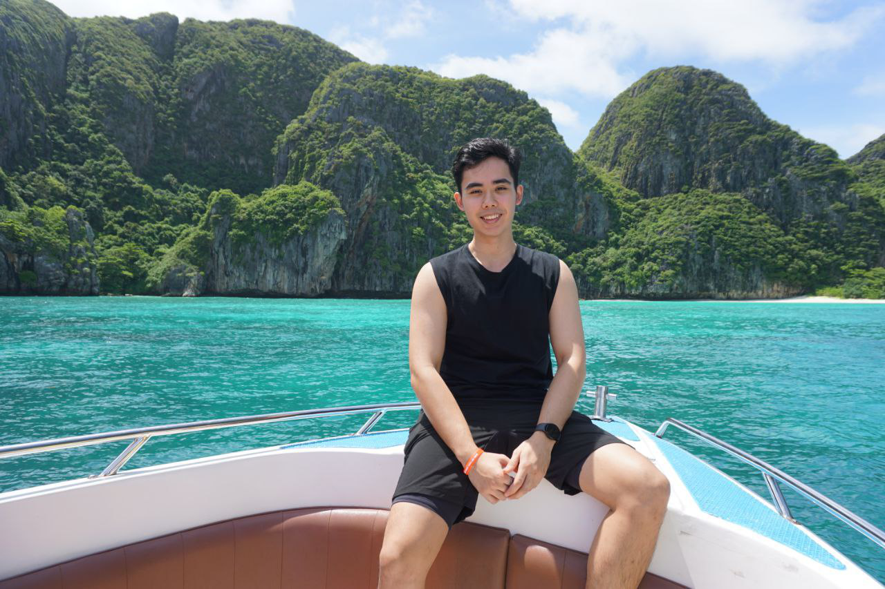

We are a team based in the [School of Computing, National University of Singapore](https://www.comp.nus.edu.sg).

You can reach us at the email `seer[at]comp.nus.edu.sg`

## Project team

### Amadeus Eka Kesuma

[[github](https://github.com/AmadeusEka)]
[[portfolio](team/amadeus.md)]

* Role: Developer
* Responsibilities: UI + Data + DevOps  

### Saw Jing Wen

[[homepage](https://jwen.cc)]
[[github](https://github.com/shotnothing)]
[[portfolio](team/sawjingwen.md)]

* Role: Developer
* Responsibilities: UI + DevOps

### Jagdeep Singh Hundal

[[github](http://github.com/JagdeepSinghNUS)]
[[portfolio](team/jagdeep.md)]

* Role: Team Lead
* Responsibilities: Ensure proper code quality and standards are met in the source code

### Wong Wei Han

[[github](http://github.com/weihanwong)] [[portfolio](team/weihanwong.md)]

* Role: Developer
* Responsibilities: Data + DevSecOps

