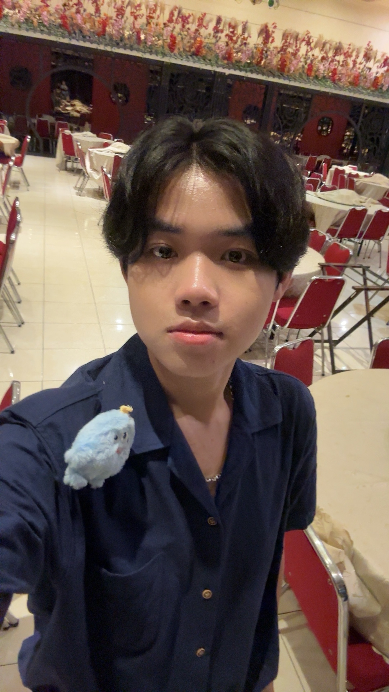
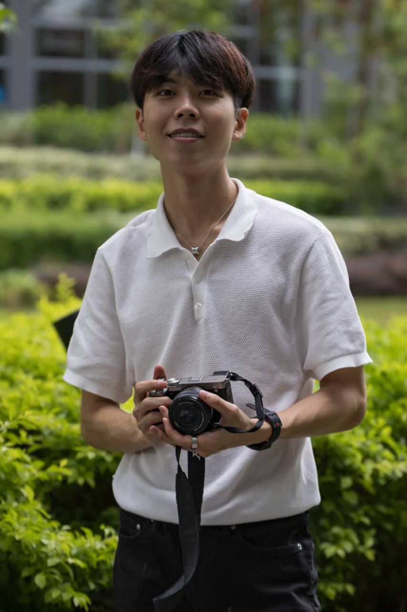
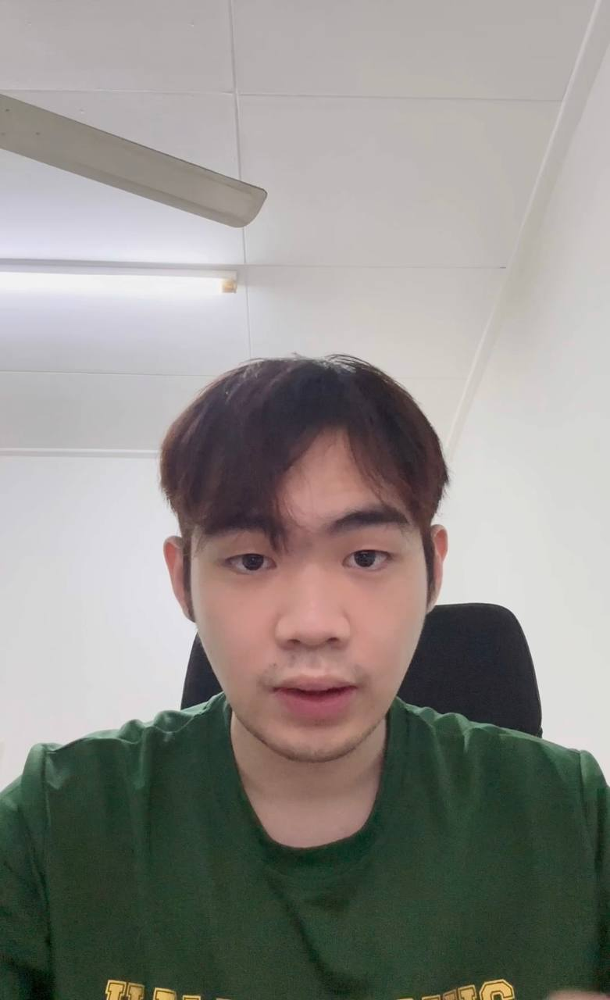
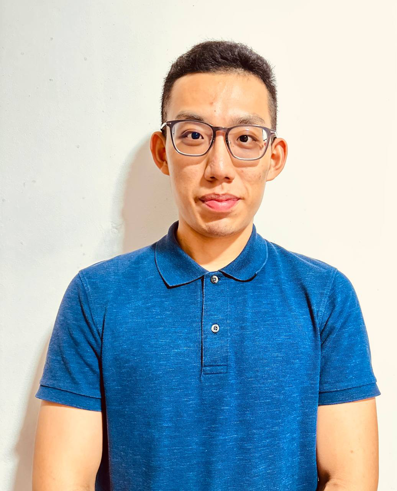
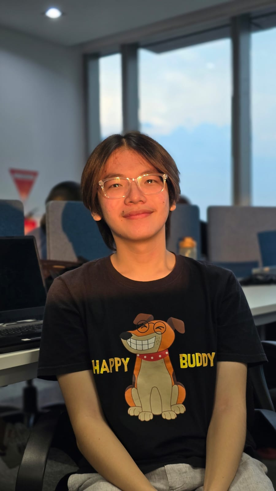

We are a team based in the [School of Computing, National University of Singapore](https://www.comp.nus.edu.sg).

## Project team

### Sandy Kristian Waluyo

[[homepage](http://www.comp.nus.edu.sg/~damithch)]
[[github](https://github.com/sandyk0105)]

* Role: Developer
* Responsibilities: Code Quality

### Nigel Teo

[[github](http://github.com/nigeltzy)]
[[portfolio](https://www.linkedin.com/in/nigel-teo-zi-you-276a452aa/)]

* Role: Developer
* Responsibilities: Data

### Tham Yao Xiang

[[github](http://github.com/tyxiangs)]

* Role: Developer
* Responsibilities: Data

### Cheng Zihao

[[github](http://github.com/chengzihao123)]
[[portfolio](https://czhportfolio.netlify.app/)]

* Role: Developer
* Responsibilities: UI and testing

### Axel

[[github](http://github.com/shinichi04)]

* Role: Developer
* Responsibilities: Data

