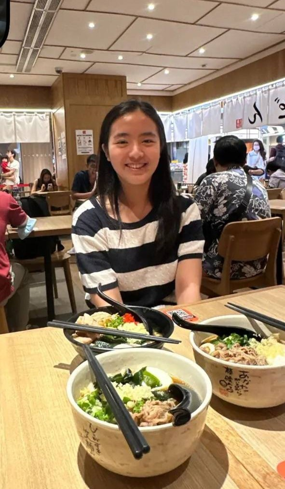

# About Us

We are a team based in the [School of Computing, National University of Singapore](http://www.comp.nus.edu.sg).

You can reach us at the email `seer[at]comp.nus.edu.sg`

## Project team

### Han B1n

[[github](https://github.com/HanB1n)]
[[portfolio](team/HanB1n.md)]

* Role: Developer

### Jane Doe

[[github](http://github.com/johndoe)]
[[portfolio](team/janedoe)]

* Role: Team Lead
* Responsibilities: UI

### Dasha Sychova

[[github](http://github.com/dasha3412)]
[[portfolio](team/dasha3412.md)]

* Role: Developer
* Responsibilities: UI, Documentation, Scheduling and tracking

### Ricco Lim

[[github](http://github.com/riccoljy)]
[[portfolio](team/riccoljy.md)]

* Role: Developer
* Responsibilities: Dev Ops + Threading

### Peh Ting Xuan

[[github](http://github.com/tingxuanp)]
[[portfolio](team/tingxuanp.md)]

* Role: Developer, Documentation, Deliverables and deadlines
* Responsibilities: UI