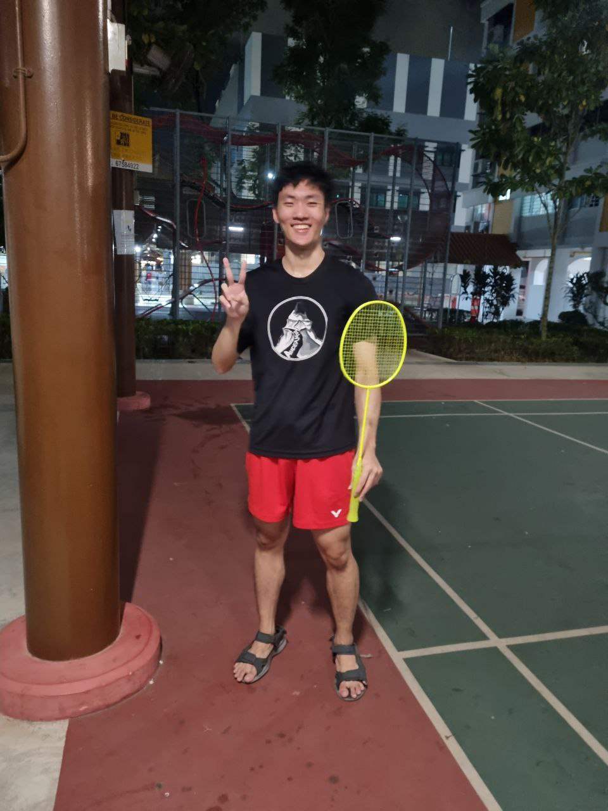
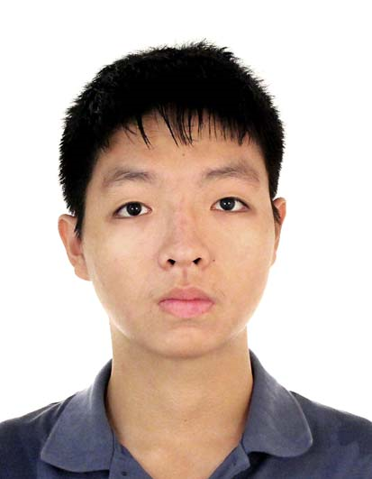
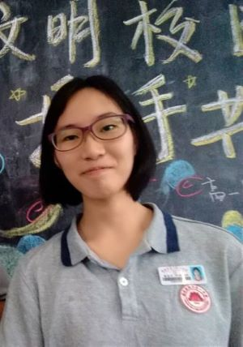

We are a team based in the [School of Computing, National University of Singapore](https://www.comp.nus.edu.sg).

You can reach us at the email `seer[at]comp.nus.edu.sg`

## Project team

### Zheng Xiangcheng

[[homepage](http://www.comp.nus.edu.sg/~damithch)]
[[github](https://github.com/xczheng0105)]
[[portfolio](team/johndoe.md)]

* Role: Member

### Jane Doe

[[github](http://github.com/johndoe)]
[[portfolio](team/johndoe.md)]

* Role: Team Lead
* Responsibilities: UI

### Chen Lei Yu

[[github](http://github.com/ChenLeiyu)] [[portfolio](team/johndoe.md)]

* Role: Developer

### Jean Doe

[[github](http://github.com/johndoe)]
[[portfolio](team/johndoe.md)]

* Role: Developer
* Responsibilities: Dev Ops + Threading

### Tan Jia Jun

[[github](http://github.com/JJtan2002)]
[[portfolio](team/JJtan2002.md)]

* Role: Developer
* Responsibilities: finish my equal share of this project

### Huang Yining

[[github](https://github.com/Kitty-001)]
[[portfolio](team/kitty-001.md)]

* Role: Developer
* Responsibilities: learn skills and try to finish my equal share
