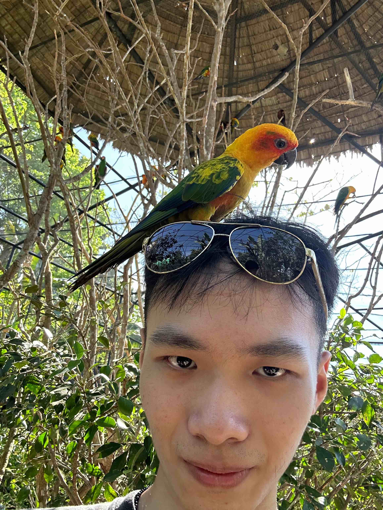

# About Us

We are a team based in the [School of Computing, National University of Singapore](http://www.comp.nus.edu.sg).

You can reach us at the email `seer[at]comp.nus.edu.sg`

## Project team

### Chengke


[[github](https://github.com/ckaayy)]

* Role: Developer
* Responsibilities: Expiring Policy alerts

### John Doe


[[homepage](http://www.comp.nus.edu.sg/~damithch)]
[[github](https://github.com/johndoe)]
[[portfolio](team/johndoe.md)]

* Role: Project Advisor

### Jane Doe


[[github](http://github.com/johndoe)]
[[portfolio](team/johndoe.md)]

* Role: Team Lead
* Responsibilities: UI

### Jeriel Chan


[[github](http://github.com/nimastic)] [[portfolio](team/nimastic.md)]

* Role: Developer
* Responsibilities: Software Developement, Dev Ops

### Rithik Lenin


[[github](http://github.com/rithiklenin)]
[[portfolio](team/rithiklenin.md)]

* Role: Developer
* Responsibilities: In charge of ```Client management```

### Toh Yi Hui



[[github](http://github.com/yihuididi)]
[[portfolio](team/yihuididi.md)]

* Role: Developer
* Responsibilities: In charge of `Policy`

