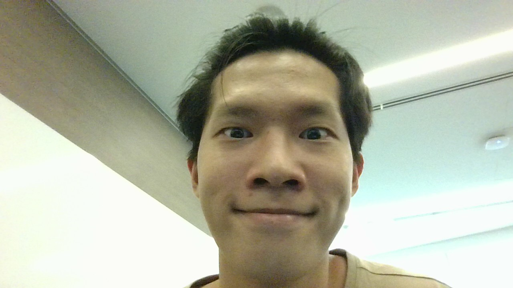

We are a team based in the [School of Computing, National University of Singapore](https://www.comp.nus.edu.sg). 
We are working on an address book for Concert Managers to manage their contacts.

## Project team

### Karthick KC

[[github](https://github.com/karthickkc)]
[[portfolio](team/karthickkc.md)]

- Role: Project Advisor
- Responsibilities: Checks on the different PR Requests and helps in reviewing

### Ng Hong Jing

[[github](http://github.com/hj235)]
[[portfolio](team/hongjing.md)]

- Role: Team Lead
- Responsibilities: Work on UI aspect

### Wesley Wong

[[github](http://github.com/wes-w-z-h)] [[portfolio](team/wesley.md)]

- Role: Developer
- Responsibilities: Add new commands to match features 

### Karthikeyan

[[github](http://github.com/SKarthikeyan28)]
[[portfolio](team/karthikeyan.md)]

- Role: Developer
- Responsibilities: Dev Ops, Enhance existing commands to specialise for concert managers  

### Zachery Ng

[[github](http://github.com/bbbbcccd)]
[[portfolio](team/zachery.md)]

- Role: Developer
- Responsibilities: Assign work (creating different issues) to different team members
- Responsibilities: Work on features listed for ConcertPhoneBook

