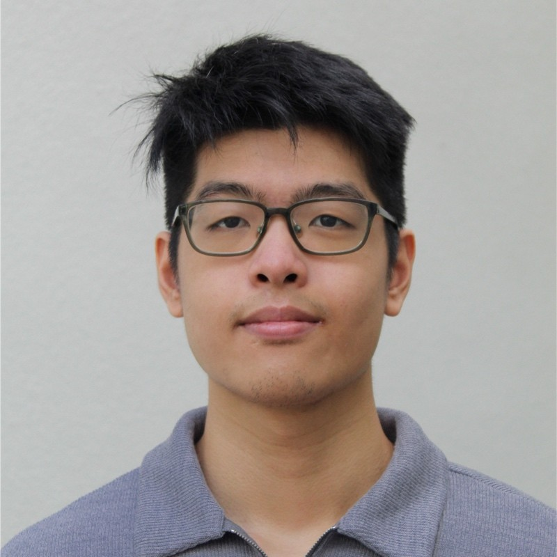
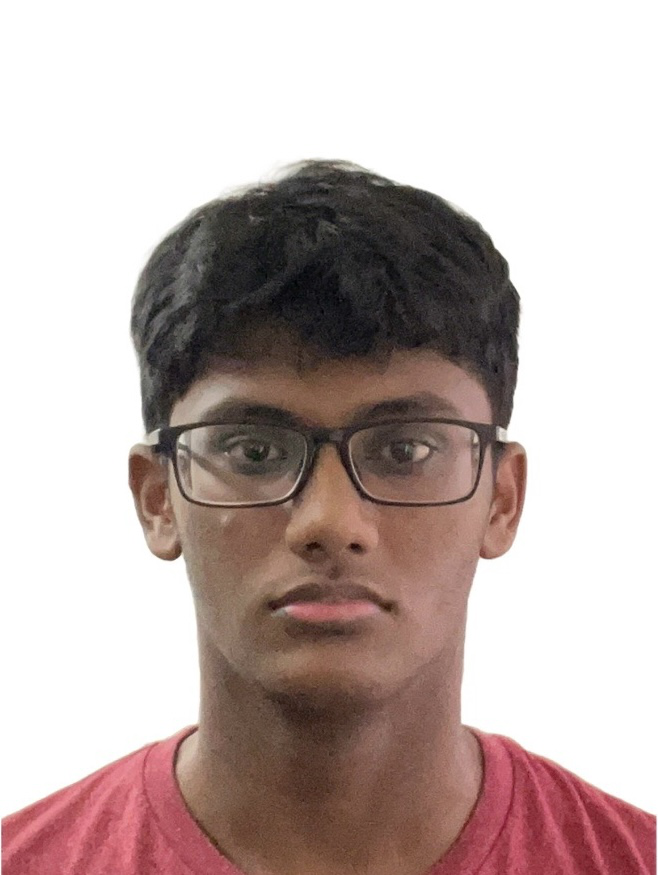
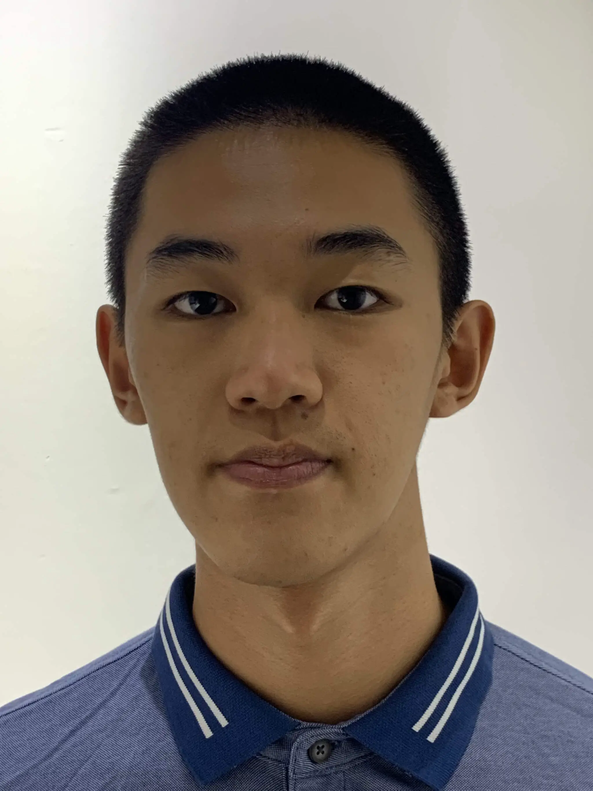

# About Us

We are a team based in the [School of Computing, National University of Singapore](http://www.comp.nus.edu.sg).

You can reach us at the email `seer[at]comp.nus.edu.sg`

## Project team

### Asveen Elavarasan

[[github](http://github.com/ashea10)] [[portfolio](team/ashea10.md)]

* Role: Developer
* Responsibilities: Data

### Johnny Doe

[[github](http://github.com/johndoe)] [[portfolio](team/johndoe.md)]

* Role: Developer
* Responsibilities: Data

### Marc Lim

[[github](http://github.com/marchjlim)]
[[portfolio](team/marchjlim.md)]

### Shashank Gorantla

[[github](http://github.com/shadhankkk)]
[[portfolio](team/shadhankkk.md)]

* Role: Developer
* Responsibilities: Dev Ops + Threading

### Michael Yang

[[github](http://github.com/michaelyql)] [[portfolio](team/michaelyql.md)]
