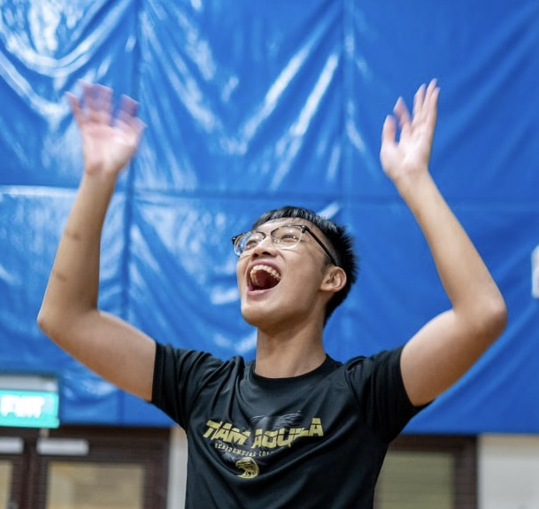
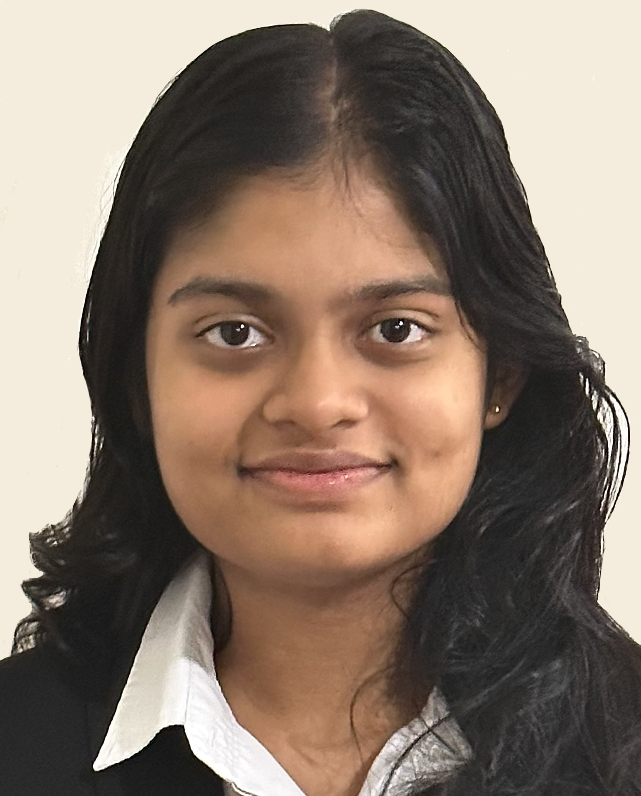
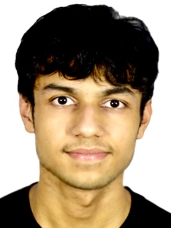
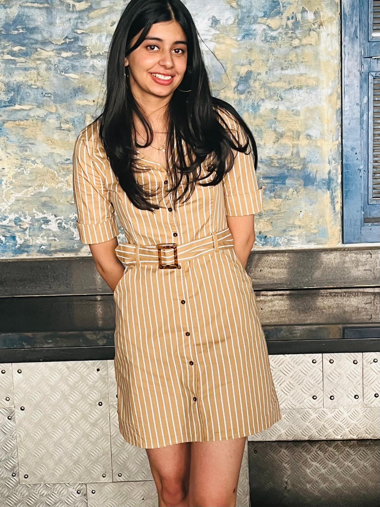
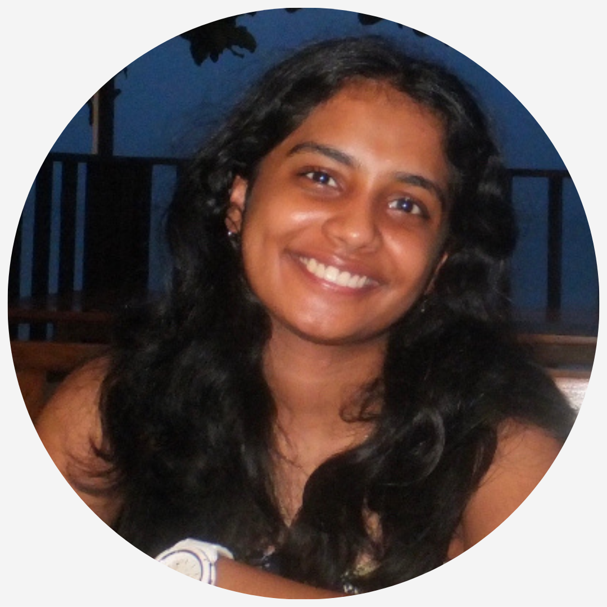

We are a team based in the [School of Computing, National University of Singapore](https://www.comp.nus.edu.sg).

You can reach us at the email `seer[at]comp.nus.edu.sg`

## Project team

### Jason Lek

[[homepage](http://www.comp.nus.edu.sg/~damithch)]
[[github](https://github.com/sornsornah)]
[[portfolio](team/johndoe.md)]

* Role: Software Engineer
* Responsibilities: Documentation

### Aditi Gawande

[[github](http://github.com/aditig0305)]
[[portfolio](team/johndoe.md)]

* Role: Developer
* Responsibilities: UI

### Samriddh Agarwal

[[github](http://github.com/samriddh2145)] [[portfolio](team/johndoe.md)]

* Role: Developer
* Responsibilities: Data

### Nihirra Kakkar

[[github](http://github.com/Nihirraa)]
[[portfolio](team/johndoe.md)]

* Role: Developer
* Responsibilities: Dev Ops + Threading

### Nayana Mahesh

[[github](https://github.com/nayanaamahesh)]
[[portfolio](team/johndoe.md)]

* Role: Developer
* Responsibilities: UI
