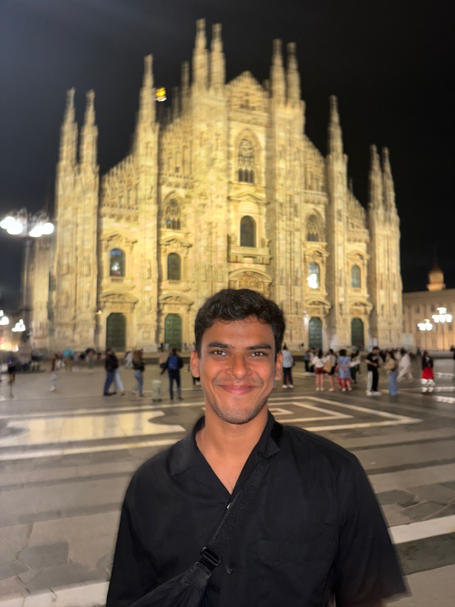
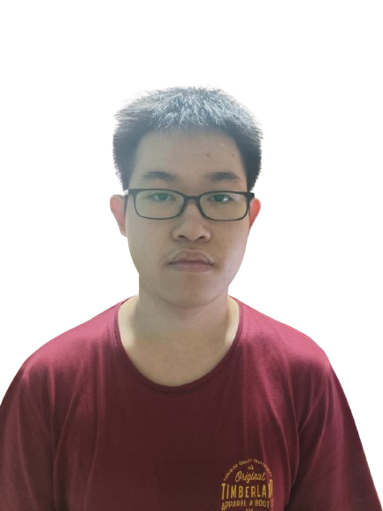

We are a team based in the [School of Computing, National University of Singapore](https://www.comp.nus.edu.sg).

You can reach us at the email `seer[at]comp.nus.edu.sg`

## Project team

### Sparsh Kumar

[[github](https://github.com/justsparsh)]
[[portfolio](team/justsparsh.md)]

* Role: Integration

### Ong Ye Hao Darren

[[github](https://github.com/O-Darren)]
[[portfolio](team/o-darren.md)]

* Role: Scheduling and tracking

### Ian Cheah

[[github](http://github.com/IanCheah)]
[[portfolio](team/johndoe.md)]

* Role: team member

### Liu Yinze

[[github](http://github.com/yinze66)] [[portfolio](team/yinze66.md)]

* Role: Deliverables and deadlines
* Responsibilities: Data

