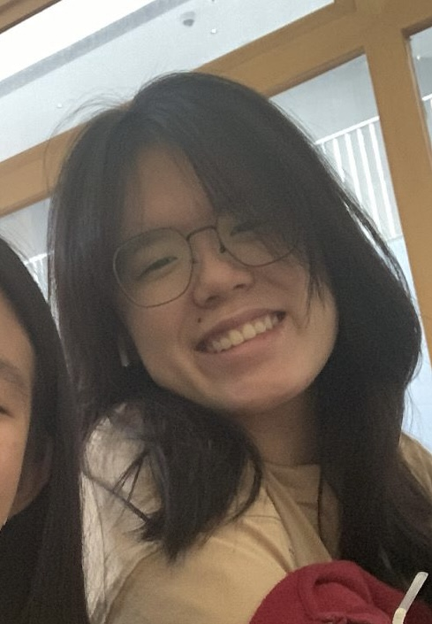
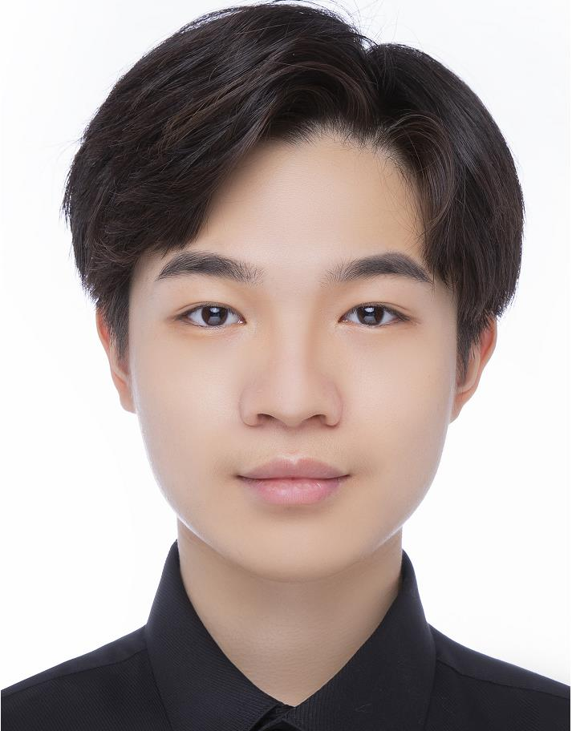

# About Us
We are a team based in the [School of Computing, National University of Singapore](http://www.comp.nus.edu.sg).

You can reach us at the email `seer[at]comp.nus.edu.sg`

## Project team

### Althea Tan

[[github](https://github.com/althea28)]

* Role: Developer
* Responsibilities: Deliverables and deadlines, Documentation, UI

### Jian Yi

[[github](http://github.com/jian7490)]
[[portfolio](team/jian7490.md)]

* Role: Developer
* Responsibilities: Models + Code quality

### Emmanuel Er

[[github](http://github.com/emmannyyy)]
* Role: Team Lead
* Responsibilities: UI

### lm-44

[[github](http://github.com/lm-44)]
[[portfolio](team/lm-44.md)]

* Role: Developer
* Responsibilities: Integration, Scheduling and tracking, In charge of Logic

### Avril Moh

[[github](https://github.com/avrilmohh)]
[[portfolio](team/avrilmohh.md)]

* Role: Developer
* Responsibilities: Testing, In charge of Main and Commons
