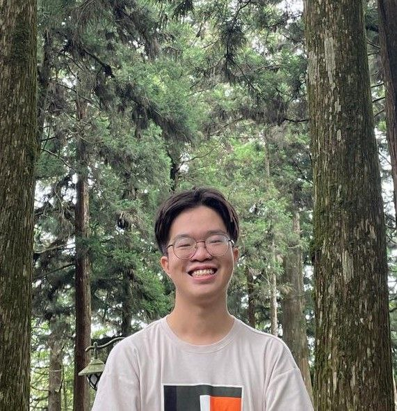
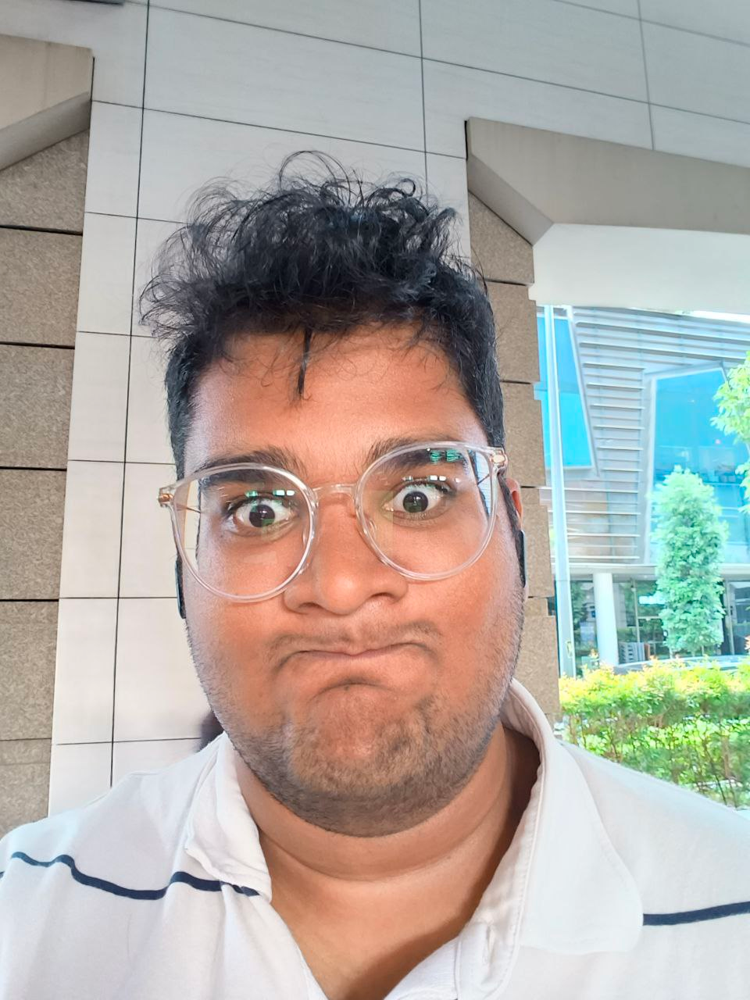
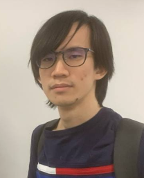
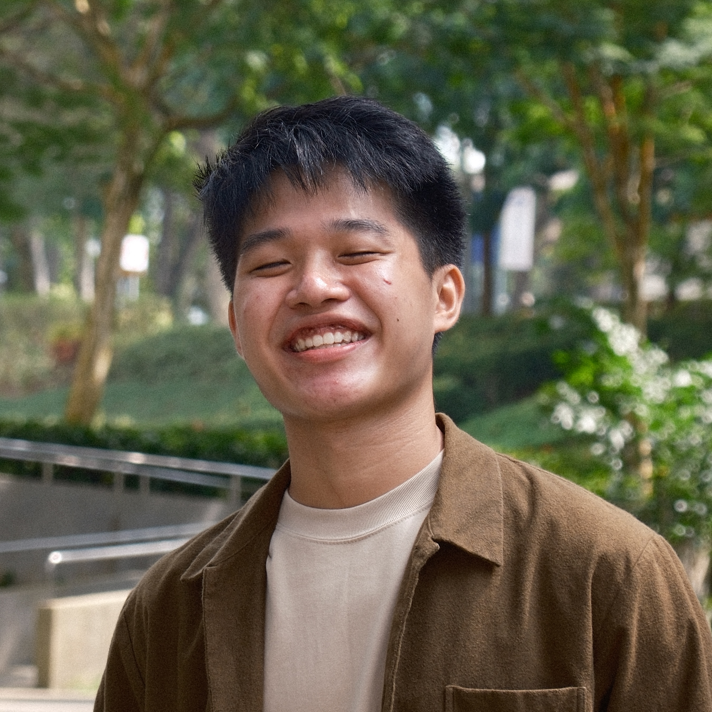

# About Us

We are a team based in the [School of Computing, National University of Singapore](http://www.comp.nus.edu.sg).

You can reach us at the email `seer[at]comp.nus.edu.sg`

## Project team

### Eliot Snodgrass

[[github](https://github.com/appleshill)]
[[portfolio](team/johndoe.md)]

* Role: Team Lead

### Arvind Natarajan

[[github](https://github.com/DiegoTheExplorar)]
[[portfolio](www.linkedin.com/in/arvind-natarajan-65aa77290)]

* Role: Documentation
* Responsibilities: I make sure codebase is well documented

### Valentin Han

[[github](http://github.com/valhrd)] [[portfolio](team/johndoe.md)]

* Role: Testing
* Responsibilities: Ensures the testing of the project is done properly and on time.

### Isaac Chan

[[github](http://github.com/frymash)]
[[portfolio](team/johndoe.md)]

* Role: Code quality
* Responsibilities: Looks after code quality, ensures adherence to coding standards, etc.

### Ryan Han

[[github](http://github.com/RyanWarwick)]
[[portfolio](team/johndoe.md)]

* Role: Deliverables and deadlines
* Responsibilities: Ensure project deliverables are done on time and in the right format.
