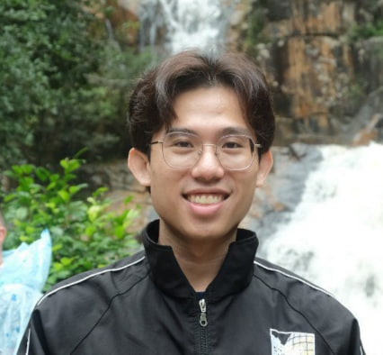

# About Us

We are a team based in the [School of Computing, National University of Singapore](http://www.comp.nus.edu.sg).

You can reach us at the email `E1120956@u.nus.edu`

### Jeremy Too

[[github](https://github.com/jtooya)]

* Role: Team Lead
* Responsibilities: Git Expert

### Kimberly 

[[github](http://github.com/kimberlytmq)] 

* Role: Deadlines and Deliverables, Scheduling and Tracking
* Responsibilities: Ensure that everyone is aware of the tasks and their respective deadlines

### Amelia Chow

[[github](http://github.com/achl1012)]

* Role: Code Quality
* Responsibilities: Ensuring code quality

### Wen Kang

[[github](http://github.com/SlothyCat)]

* Role: Documentation Expert
* Responsibilities: Ensures Documentation is consistent and up to standards 

### Zien Xu

[[github](http://github.com/zienxu)]

* Role: Tester
* Responsibilities: Ensures the testing of the project is done properly and on time.

