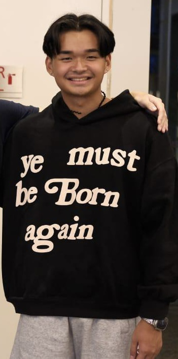
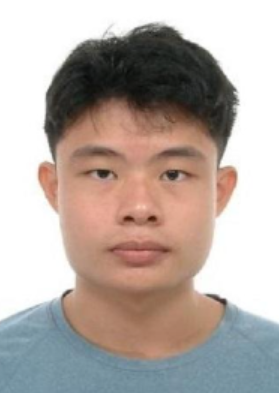
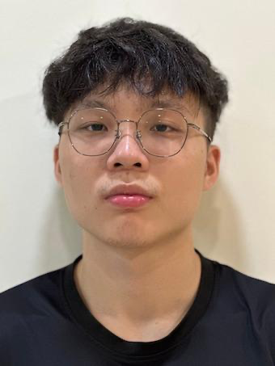
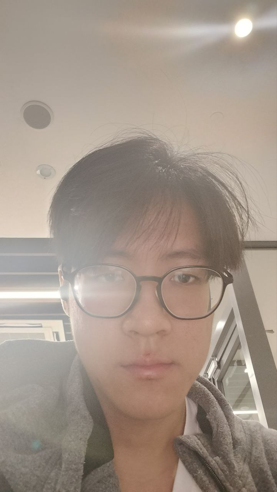
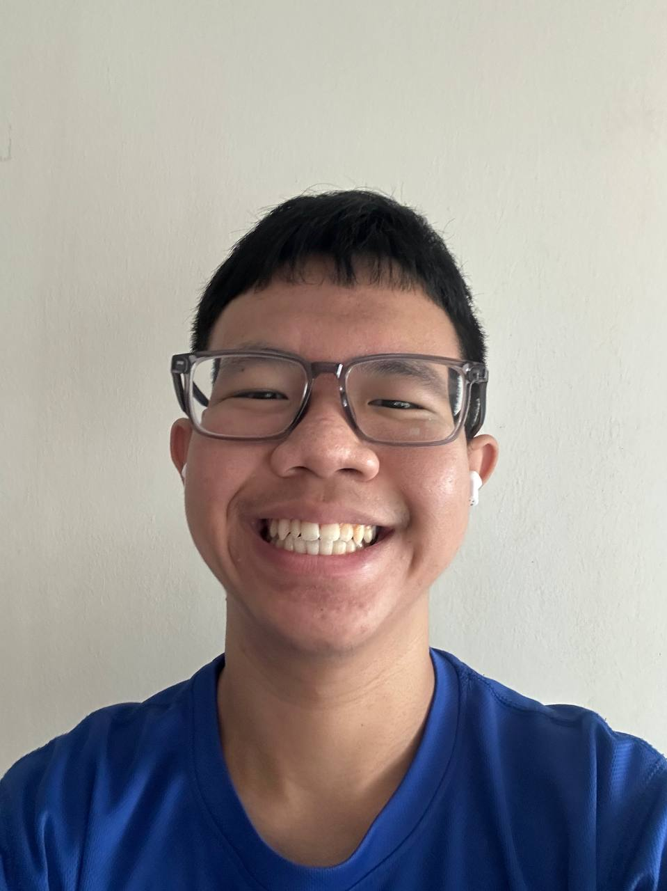

# About Us

We are a team based in the [School of Computing, National University of Singapore](http://www.comp.nus.edu.sg).

You can reach us at the email `seer[at]comp.nus.edu.sg`

## Project team

### Ryan Lim

[[github](https://github.com/rynlwhh)]

- Role: Developer
- Responsibilities: Data

### Vince Goh

I like to read books and my favourite genre is mystery. I also like to run and play badminton in my free time.

[[github](https://github.com/vinceg4)]

- Role: Developer
- Reponsibilties: Code Quality

### Mattis Ong

I like to touch grass

[[github](https://github.com/mattisongjj)]

- Role: Team Lead
- Responsibilities: Integration

### Ling Zi Yan

Hello my name is ziyan and I love cs2103T and cs2101

[[github](http://github.com/LingZiyann)] [[portfolio](team/johndoe.md)]

- Role: Developer
- Responsibilities: Testing + Deliverables

### Teo Choon Keong

Hello my name is Choon Keong and I like singing.

[[github](https://github.com/tckeong)] [[portfolio](team/johndoe.md)]

- Role: Developer
- Responsibilities: Logic
