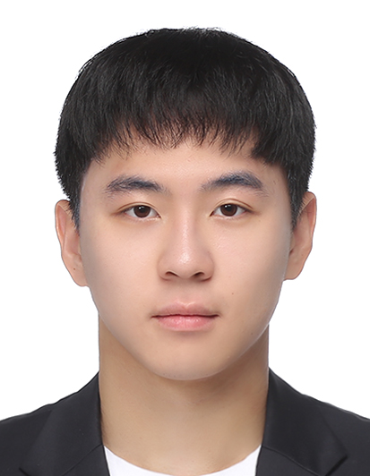
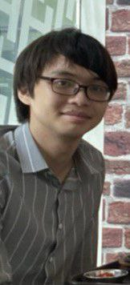
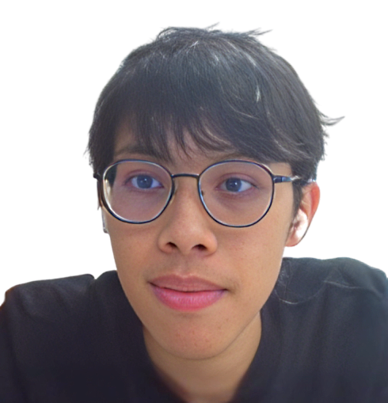
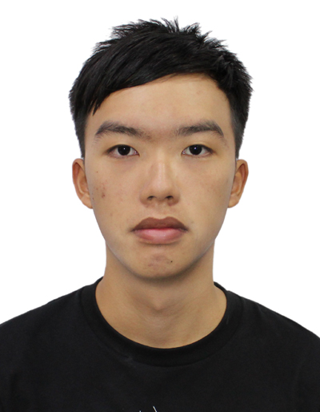
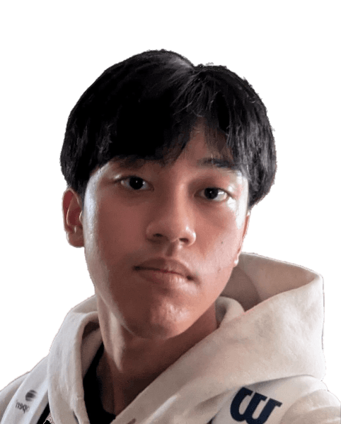

# About Us

We are a team based in the [School of Computing, National University of Singapore](http://www.comp.nus.edu.sg).

You can reach us at the email `seer[at]comp.nus.edu.sg`

## Project team

### Jae Hyeok Kim

[[homepage](http://kjaehyeok21.dev)]
[[github](https://github.com/zzawook)]
[[portfolio](team/johndoe.md)]

* Role: Developer
* Responsibilities: Testing, Integration, Code Quality

### Chen Yu Bryan

[[github](https://github.com/bryancheny)]
[[portfolio](team/johndoe.md)]

* Role: Developer
* Responsibilities: Model, Logic, Storage

### Isaac Ng

[[github](http://github.com/izn432)]
[[portfolio](team/johndoe.md)]

* Role: Developer
* Responsibilities: Ui

### Wong Swee Chong, Dave

[[github](http://github.com/dwsc37)]
[[portfolio](team/johndoe.md)]

* Role: Team Lead
* Responsibilities: Code Review, Project Management

### Audi Prasanto

[[github](http://github.com/audipras)]
[[portfolio](team/johndoe.md)]

* Role: Developer
* Responsibilities: Documentation
