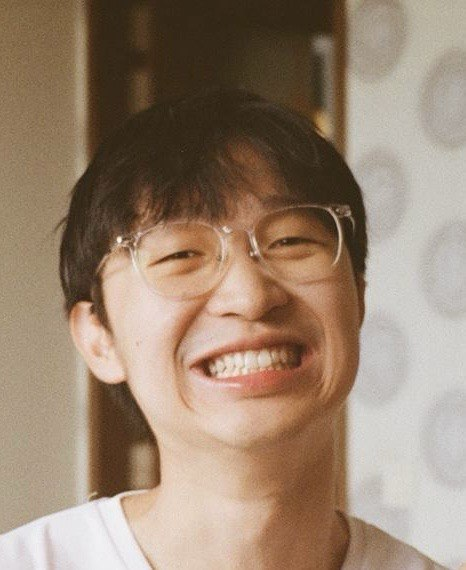
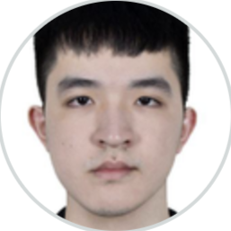
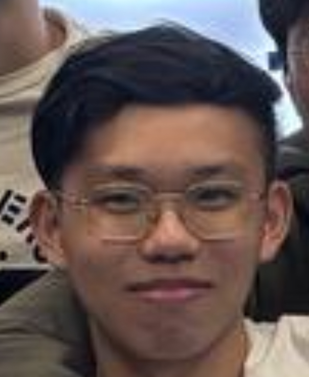

We are a team based in the [School of Computing, National University of Singapore](https://www.comp.nus.edu.sg).

You can reach us at the email `seer[at]comp.nus.edu.sg`

## Project team

### Clarence Yeo

[[github](https://github.com/clarenceeey)]
[[portfolio](team/clarence.md)]

* Role: Project Developer

### notnotmax

[[github](https://github.com/notnotmax)]
[[portfolio](team/notnotmax.md)]

* Role: Developer
* Responsibilities: Deliverables, Deadlines, Scheduling and Tracking

### Marcus Ang

[[github](http://github.com/marcusjhang)]
[[portfolio](team/marcusjhang.md)]

* Role: Software Developer
* Responsibilities: Data

### Han Yi

[[github](https://github.com/yhanyi)]
[[portfolio](team/yhanyi.md)]

* Role: Developer
* Responsibilities: Dev Ops + Threading

### Sky Lim Kai Yi

[[github](https://github.com/S-K-Y-Light)]
[[portfolio](team/sky.md)]

* Role: Project Developer
* Responsibilities: Documentation
