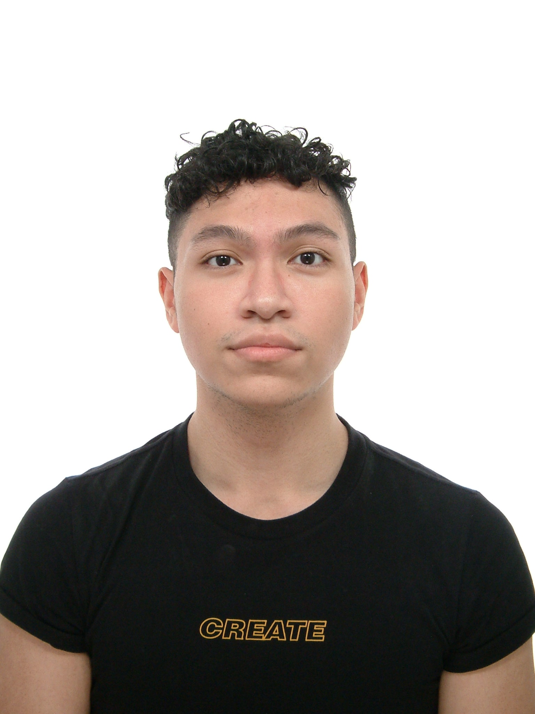
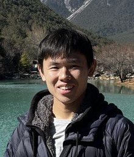

# About Us

We are a team based in the [School of Computing, National University of Singapore](http://www.comp.nus.edu.sg).

You can reach us at the email `seer[at]comp.nus.edu.sg`

## Project team

### Isaac Pang Teng Hong

[[github](https://github.com/IsaacPangTH)]
[[portfolio](team/isaac.md)]

* Role: Documentation Lead
* Responsibilities: Documentation, IntelliJ Expert, Git CLI Expert, In charge of Model

### Chua Kee Chin

[[github](http://github.com/ckclion)]
[[portfolio](team/ckclion.md)]

* Role: Testing Lead
* Responsibilities: Ensures the testing of the project is done properly and on time.

### Lutfir Rahman

[[github](http://github.com/lutfir-cpu)] [[portfolio](team/lutfir-cpu.md)]

* Role: Team Lead, Integration Lead
* Responsibilities: In charge of integrations/pull requests. Sets direction of the project. Git/Github expert.

### Ding Yi He

[[github](http://github.com/oneBoz)]
[[portfolio](team/oneboz.md)]

* Role: Code Quality Lead
* Responsibilities: Code quality, Testing, UI

### Elliot Tang

[[github](http://github.com/elliot-tang)]
[[portfolio](team/elliot.md)]

* Role: Scheduling and tracking lead, deliverables and deadlines lead
* Responsibilities: In charge of Logic component
