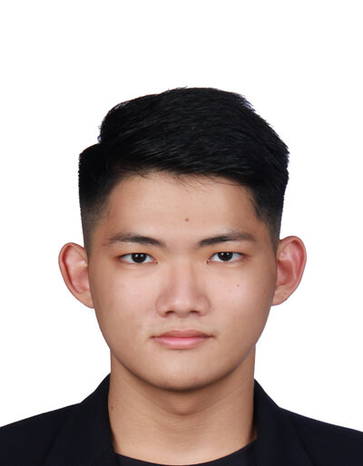
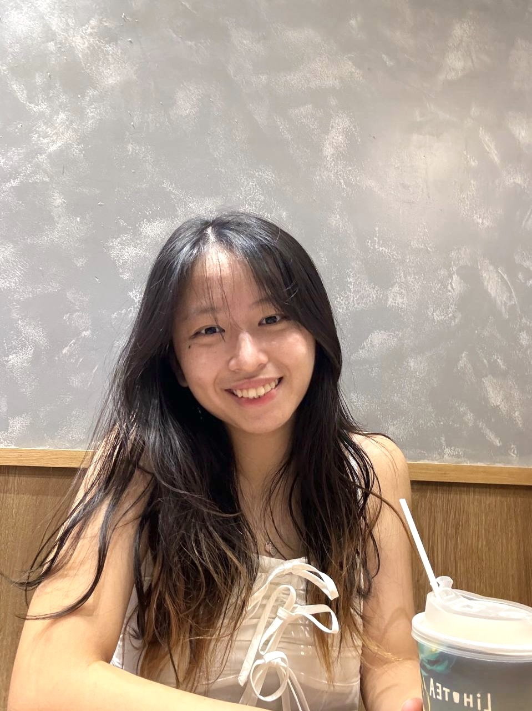

We are a team based in the [School of Computing, National University of Singapore](https://www.comp.nus.edu.sg).

You can reach us at the email `seer[at]comp.nus.edu.sg`

## Project team

### Chew Tsze Honn

[[homepage](http://www.comp.nus.edu.sg/~damithch)]
[[github](https://github.com/zeonchew0324)]
[[portfolio](team/johndoe.md)]

* Role: Project Advisor
* Responsibilities: Project Management

### Jia Xin

[[github](http://github.com/jiaxinnns)]
[[portfolio](team/jiaxin.md)]

* Role: Developer
* Responsibilities: UI

### Johnny Doe

[[github](http://github.com/johndoe)] [[portfolio](team/johndoe.md)]

* Role: Developer
* Responsibilities: Data

### Jean Doe

[[github](http://github.com/johndoe)]
[[portfolio](team/johndoe.md)]

* Role: Developer
* Responsibilities: Dev Ops + Threading

### James Doe

[[github](http://github.com/johndoe)]
[[portfolio](team/johndoe.md)]

* Role: Developer
* Responsibilities: UI
