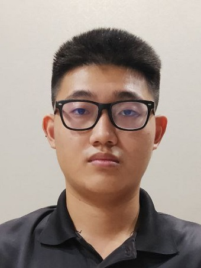

# About Us

We are a team based in the [School of Computing, National University of Singapore](http://www.comp.nus.edu.sg).

You can reach us at the email `seer[at]comp.nus.edu.sg`

## Project team

### Alqasim Elyas Zuhair A

[[github](https://github.com/eru111)]
[[portfolio](team/alqasimelyaszuhaira.md)]

* Role: Developer
* Responsibilities: Storage

### Nicholas Chan

[[github](https://github.com/kaajinn)]
[[portfolio](team/kaajinn.md)]

* Role: Developer
* Responsibilities: Data

### Zhao Yiheng

[[github](http://github.com/linedoestrolling)]
[[portfolio](team/zhaoyiheng.md)]

* Role: Developer
* Responsibilities: UI

### Jean Doe

[[github](http://github.com/johndoe)]
[[portfolio](team/johndoe.md)]

* Role: Developer
* Responsibilities: Dev Ops + Threading

### James Doe

[[github](http://github.com/johndoe)]
[[portfolio](team/johndoe.md)]

* Role: Developer
* Responsibilities: UI
