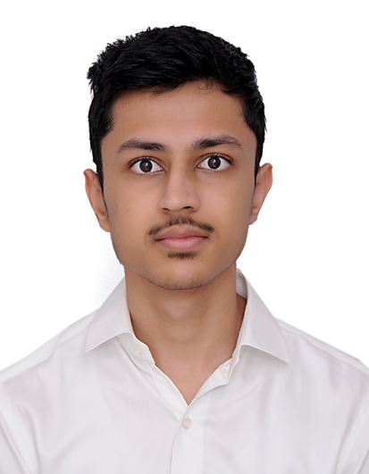
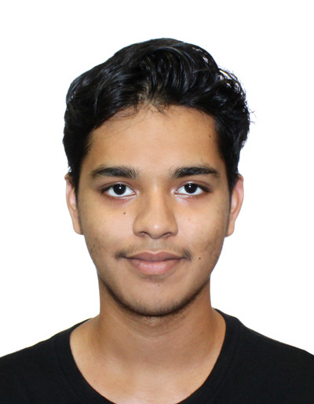
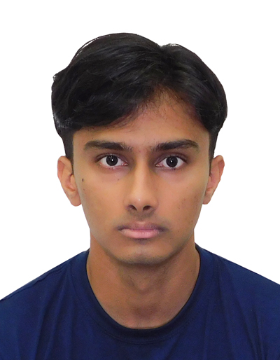
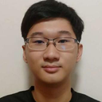
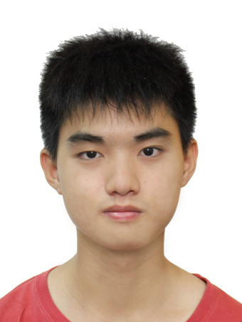

We are a team based in the [School of Computing, National University of Singapore](https://www.comp.nus.edu.sg).

You can reach us at the email `seer[at]comp.nus.edu.sg`

## Project team

### Garg Maahir Rajesh

[[github](http://github.com/maahir-garg)]
[[portfolio](team/johndoe.md)]

* Role: Team Lead
* Responsibilities: UI

### Goel Arnav

[[github](http://github.com/arnaxx54)] [[portfolio](team/johndoe.md)]

* Role: Developer
* Responsibilities: Data

### Nihal Ramesh

[[github](http://github.com/nihalramesh12629)]
[[portfolio](team/johndoe.md)]

* Role: Developer
* Responsibilities: Dev Ops + Threading

### Adrian Leonardo Liang

[[github](http://github.com/AgentHagu)]
[[portfolio](team/agenthagu.md)]

* Role: Developer
* Responsibilities: UI

### Amos Chee Tian Ee

[[github](https://github.com/amoschee)]
[[portfolio](team/amoschee.md)]
