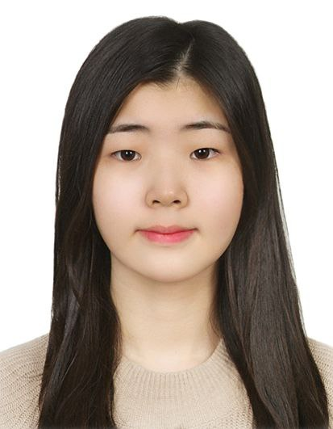
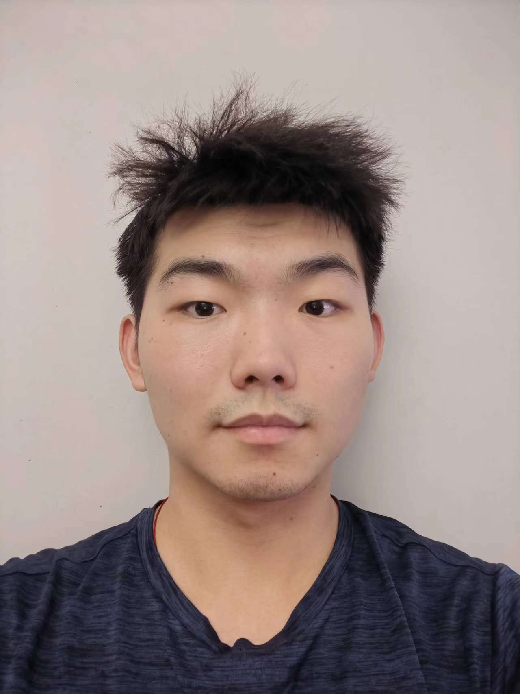
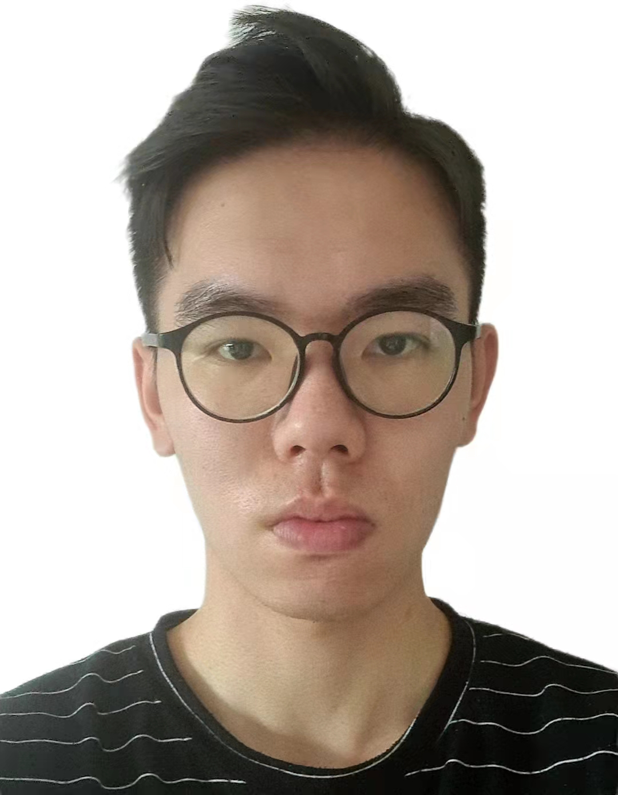

# About Us

We are a team based in the [School of Computing, National University of Singapore](http://www.comp.nus.edu.sg).

You can reach us at the email `seer[at]comp.nus.edu.sg`

## Project team

### Park Seyouong (Judy)

[[github](https://github.com/Judy1x4)]

* Role: Documentation

### Lu Ruijian

[[github](http://github.com/RuijianLu)]

* Role: member

### Hu Hong Rui

[[github](http://github.com/muller317)] [[portfolio](team/johndoe.md)]

* Role: member
* Responsibilities: Data

### Eng Yu Han

[[github](http://github.com/engyuhan)]

* Role: member
* Responsibilities: none

### James Doe

[[github](http://github.com/johndoe)]
[[portfolio](team/johndoe.md)]

* Role: Developer
* Responsibilities: UI
