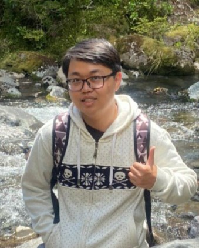
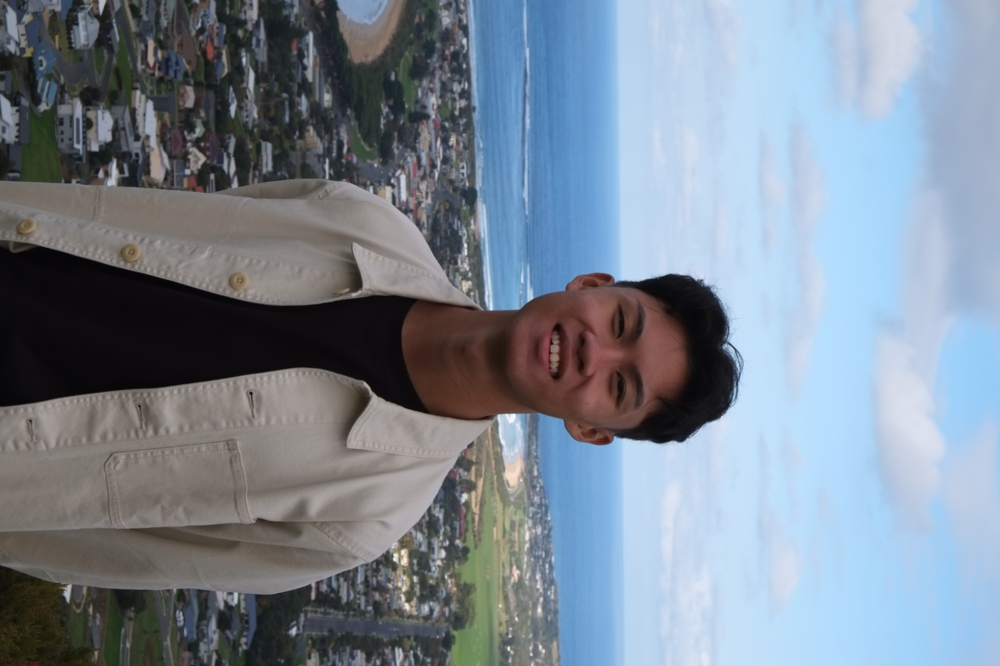
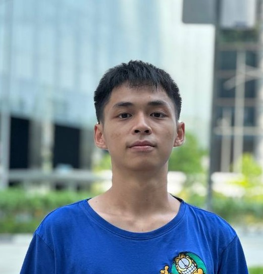
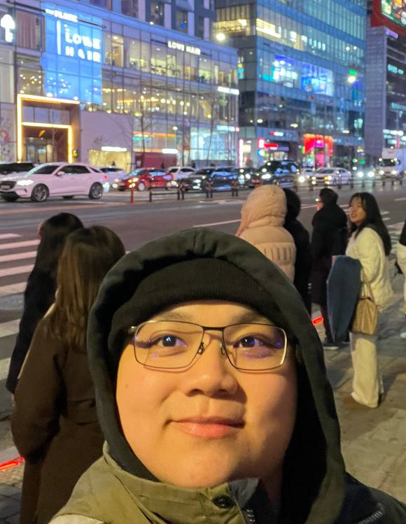

# About Us

We are a team based in the [School of Computing, National University of Singapore](http://www.comp.nus.edu.sg).

You can reach us at the email `seer[at]comp.nus.edu.sg`

## Project team

### Bryan Chan Kah Hoe

[[homepage](http://www.comp.nus.edu.sg/~damithch)]
[[github](https://github.com/bryanckh)]
[[portfolio](team/bryanckh.md)]

* Role: Project Advisor

### Goh Song Lin

[[github](http://github.com/gohsl99)]
[[portfolio](team/gohsl99.md)]

* Role: Team Lead
* Responsibilities: UI

### Zachary Kang

[[github](http://github.com/zackjh)]
[[portfolio](team/zackjh.md)]

* Role: Developer
* Responsibilities: Data and Others

### Nathan Lye

[[github](http://github.com/robotwizzard)]
[[portfolio](team/robotwizzard.md)]

* Role: Developer
* Responsibilities: Dev Ops + Threading

### Winston Lim Jun Yang

[[github](http://github.com/winstonlimjy)]
[[portfolio](team/winstonlimjy.md)]

* Role: Developer
* Responsibilities: Ui
