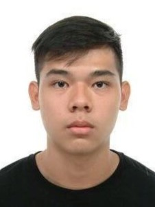
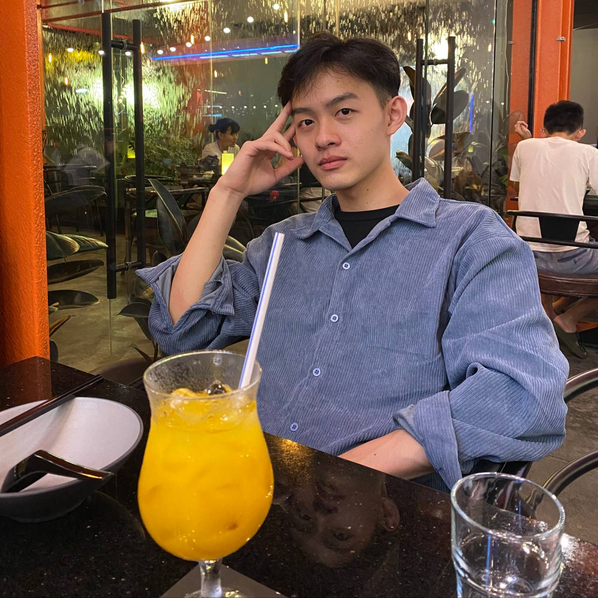
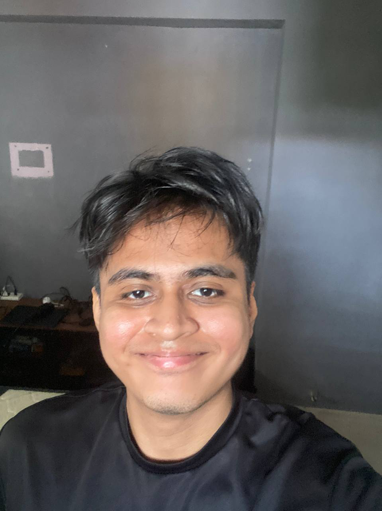

We are a team based in the [School of Computing, National University of Singapore](https://www.comp.nus.edu.sg).

You can reach us at the email `seer[at]comp.nus.edu.sg`

## Project team

### John Doe

[[homepage](http://www.comp.nus.edu.sg/~damithch)]
[[github](https://github.com/johndoe)]
[[portfolio](team/johndoe.md)]

* Role: Project Advisor

### Lam Rong Yi

[[github](http://github.com/lrongyi)]

* Role: Developer
* Responsibilities: UI

### Johnny Doe

[[github](http://github.com/johndoe)] [[portfolio](team/johndoe.md)]

* Role: Developer
* Responsibilities: Data

### Tan Wen Xuan

[[github](http://github.com/e1121208)]
[[portfolio](team/e1121208.md)]

* Role: Developer
* Responsibilities: Dev Ops + Threading

### Muhammad

[[github](http://github.com/johndoe)]
[[portfolio](team/johndoe.md)]

* Role: Developer, Testing
* Responsibilities: UI
