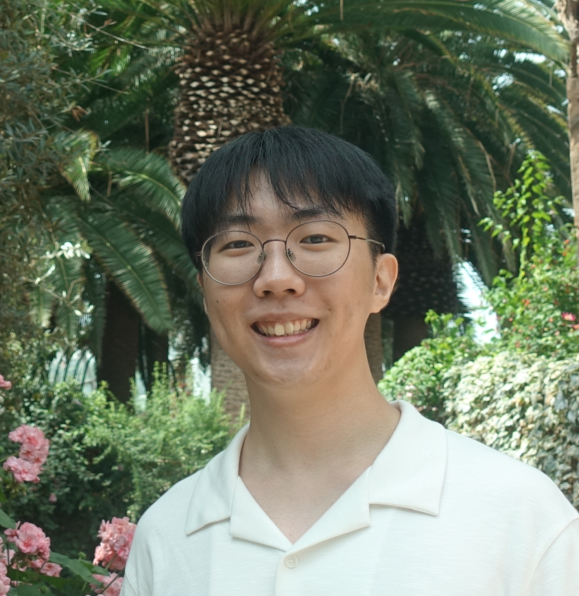
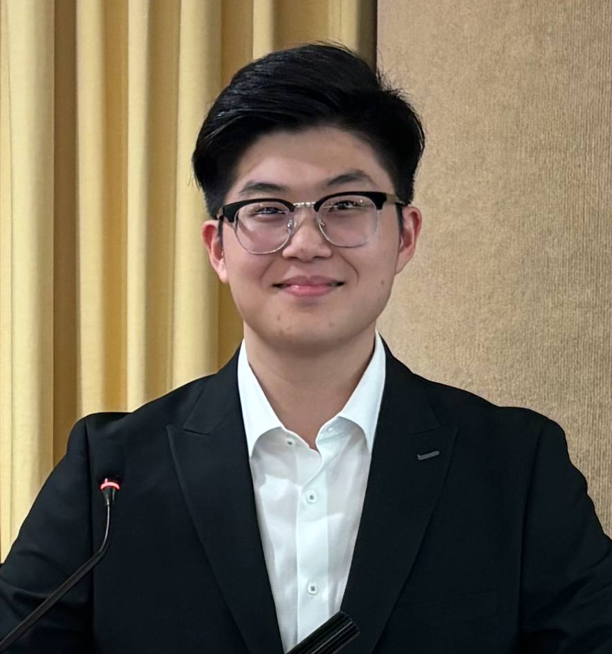

We are a team based in the [School of Computing, National University of Singapore](https://www.comp.nus.edu.sg).

You can reach us at the email `seer[at]comp.nus.edu.sg`

## Project team

### Chen Shaoheng

[[github](https://github.com/cshao02)]
[[portfolio](team/johndoe.md)]

* Role: Developer
* Responsibilities: Documentation, Testing

### Chua Jun Yu

[[github](http://github.com/chuajunyu)]
[[portfolio](team/johndoe.md)]

* Role: Team Lead
* Responsibilities: Git expert

### Brian Choon

[[github](http://github.com/brianchoon)] [[portfolio](team/brianchoon.md)]

* Role: Developer
* Responsibilities: Feature In-Charge, IntelliJ Expert

### Then Jan Kai

[[github](http://github.com/jan-kai1)]
[[portfolio](team/johndoe.md)]

* Role: Developer
* Responsibilities: Scheduling + Integration

### James Doe

[[github](http://github.com/johndoe)]
[[portfolio](team/johndoe.md)]

* Role: Developer
* Responsibilities: UI
