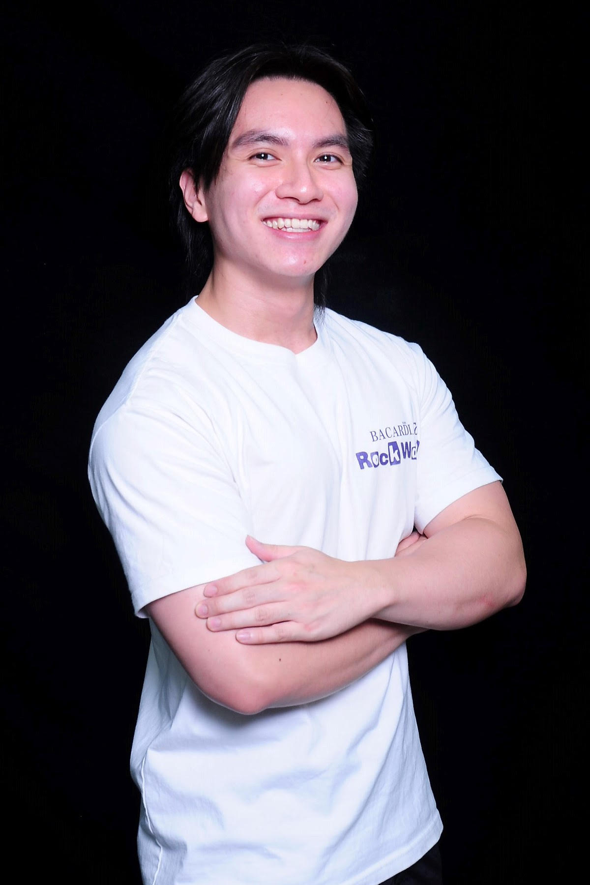
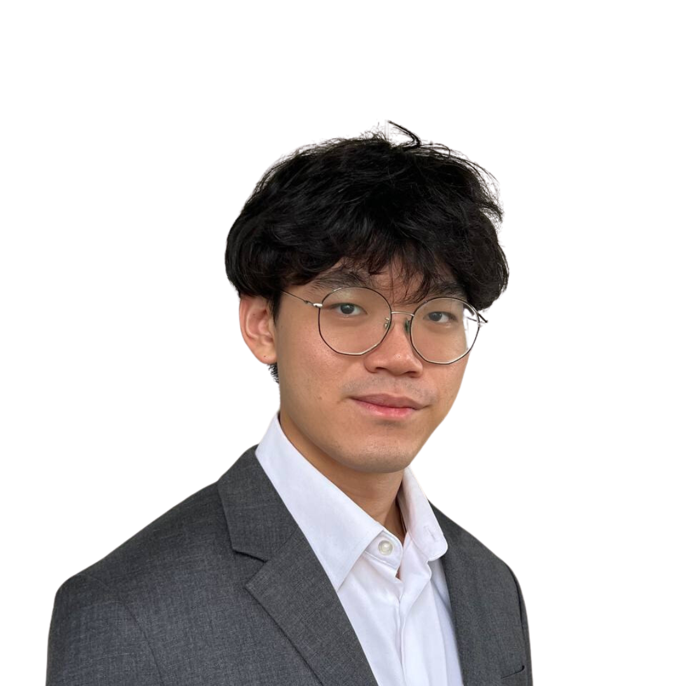
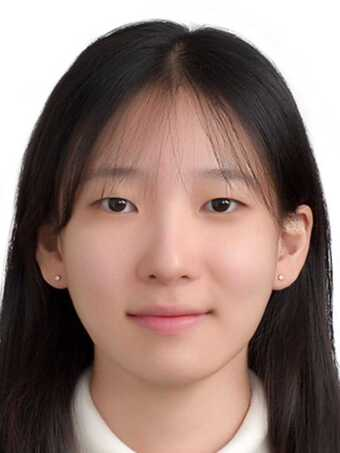
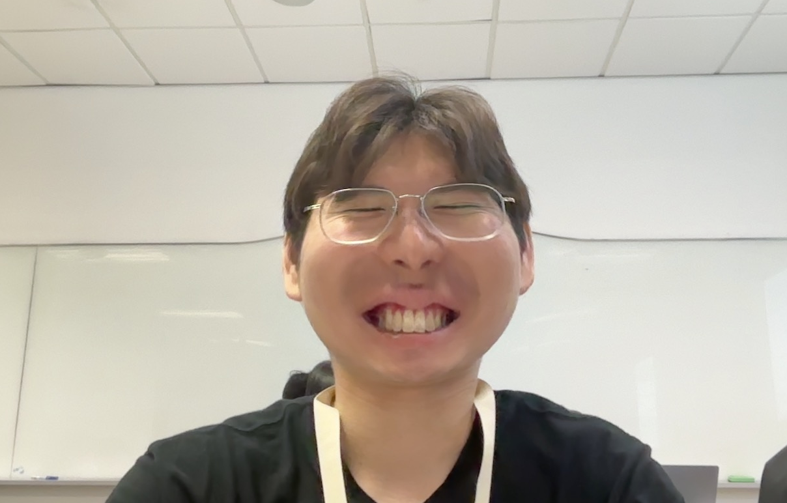

We are a team based in the [School of Computing, National University of Singapore](https://www.comp.nus.edu.sg).

You can reach us at the email `seer[at]comp.nus.edu.sg`

## Project team

### Beh Wen Jie

[[github](https://github.com/wenjebs)]
[[portfolio](team/johndoe.md)]

* Role: Project Advisor
* Responsibilities: Mewing

### Yim Jian Bing

[[github](http://github.com/yimjianbing)]
[[portfolio](team/johndoe.md)]

* Role: Frontend designer
* Responsibilities: UI

### Martin NGGGGGG

[[github](http://github.com/johndoe)] [[portfolio](team/johndoe.md)]

* Role: Developer
* Responsibilities: Data

### Annie Song Si Hyun

[[github](http://github.com/hyxnnii)]
[[portfolio](team/hyxnnii.md)]

* Role: Developer
* Responsibilities: Dev Ops + Threading

### Shaun Lee

[[github](http://github.com/hoodini231)]
[[portfolio](team/johndoe.md)]

* Role: Back-end Developer
* Responsibilities: Database
