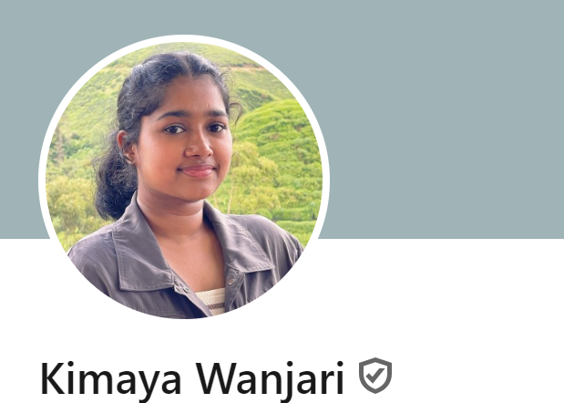

We are a team based in the [School of Computing, National University of Singapore](https://www.comp.nus.edu.sg).

You can reach us at the email `seer[at]comp.nus.edu.sg`

## Project team

### Nikhil Sultania

[[LinkedIn](www.linkedin.com/in/nikhil-sultania)]
[[github](https://github.com/Timenikhil)]
[[portfolio](team/timenikhil.md)]

* Role: Team Lead

### Theodore Lim

[[github](http://github.com/obrona)]
[[portfolio](http://github.com/obrona)]

* Role: Team Lead
* Responsibilities: UI

### Josh Thoo Jen Sen

[[github](http://github.com/joshthoo)] [[portfolio](team/johndoe.md)]

* Role: Developer
* Responsibilities: Data

### Kimaya Wanjari

[[github](http://github.com/kimxw)]
[[portfolio](team/kimxw.md)]

* Role: Developer
* Responsibilities: Team Lead

### Nathan Shew

[[github](http://github.com/nathanshew)]
[[portfolio](team/nathanshew.md)]

* Role: Developer
* Responsibilities: Project Management and 
