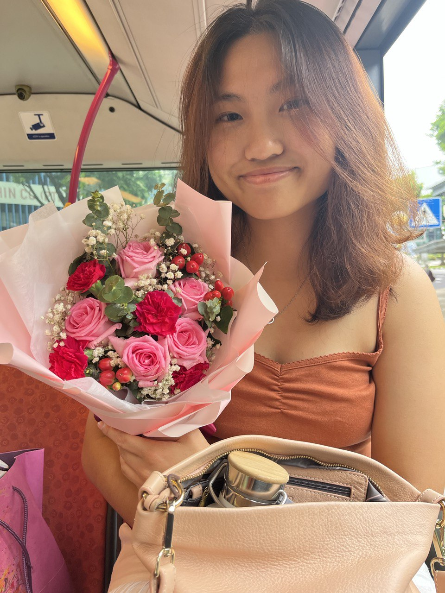
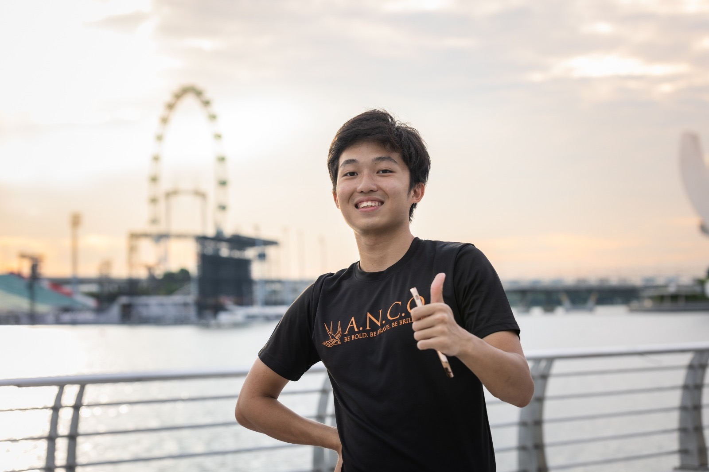

We are a team based in the [School of Computing, National University of Singapore](https://www.comp.nus.edu.sg).

You can reach us at the email `seer[at]comp.nus.edu.sg`

## Project team

### Lim Qiao Yi

[[github](https://github.com/meatyturtle)]
[[linkedin](https://linkedin.com/limqiaoyi)]

* Role: Developer
* Responsibility: Integration

### Shane Tay

[[github](http://github.com/shantaa)]
[portfolio]

* Role: Documentation
* Responsibilities: Responsible for the quality of various project documents.

### Justin Aw

[[github](http://github.com/Justin-Aw46)]
[portfolio]

* Role: Developer
* Responsibilities: Testing

### Joshua Ng

[[github](http://github.com/AlphaPyke)]
[portfolio]

* Role: Code Quality
* Responsibilities: Looks after code quality, ensures adherence to coding standards and git standards.

### Tiew Wei Xuan

[[github](http://github.com/fymbc)]
[portfolio]

* Role: Team Lead
* Responsibilities: Scheduling, Tracking, Deliverables, Deadlines
