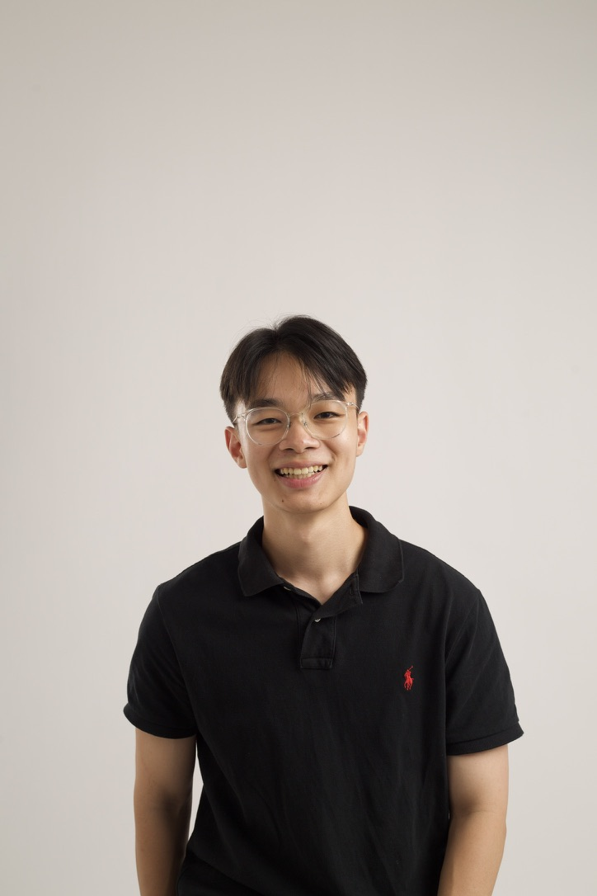

We are a team based in the [School of Computing, National University of Singapore](https://www.comp.nus.edu.sg).

## Project team

### Clarence Yeo

[[homepage](http://www.comp.nus.edu.sg/~damithch)]
[[github](https://github.com/clarenceeey)]
[[portfolio](team/clarence.md)]

* Role: Project Advisor

### notnotmax

[[github](https://github.com/notnotmax)]
[[portfolio](team/notnotmax.md)]

* Role: Developer
* Responsibilities: Deliverables, Deadlines, Scheduling and Tracking

### Marcus Ang

[[github](http://github.com/marcusjhang)] [[portfolio](team/marcusjhang.md)]

* Role: Developer
* Responsibilities: Data

### John Doe

[[github](http://github.com/johndoe)]
[[portfolio](team/johndoe.md)]

* Role: Developer
* Responsibilities: Dev Ops + Threading

### Sky Lim Kai Yi

[[github](https://github.com/S-K-Y-Light)]
[[portfolio](team/sky.md)]

* Role: Project Developer
* Responsibilities: Documentation
