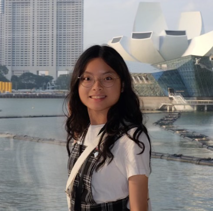

We are a team based in the [School of Computing, National University of Singapore](https://www.comp.nus.edu.sg).

You can reach us at the email `seer[at]comp.nus.edu.sg`

## Project team

### John Doe

[[homepage](http://www.comp.nus.edu.sg/~damithch)]
[[github](https://github.com/johndoe)]
[[portfolio](team/johndoe.md)]

- Role: Project Advisor

### Jia Yi

[[github](http://github.com/jiayi-gallium369)]
[[portfolio](team/jiayi-gallium369.md)]

- Role: Developer
- Responsibilities: UI

### Siow Rui Ming

[[github](http://github.com/ruiming97)] 
[[portfolio](team/ruiming97.md)]

- Role: Developer
- Responsibilities: Data

### Jean Doe

[[github](http://github.com/johndoe)]
[[portfolio](team/johndoe.md)]

- Role: Developer
- Responsibilities: Dev Ops + Threading

### James Doe

[[github](http://github.com/johndoe)]
[[portfolio](team/johndoe.md)]

- Role: Developer
- Responsibilities: UI
