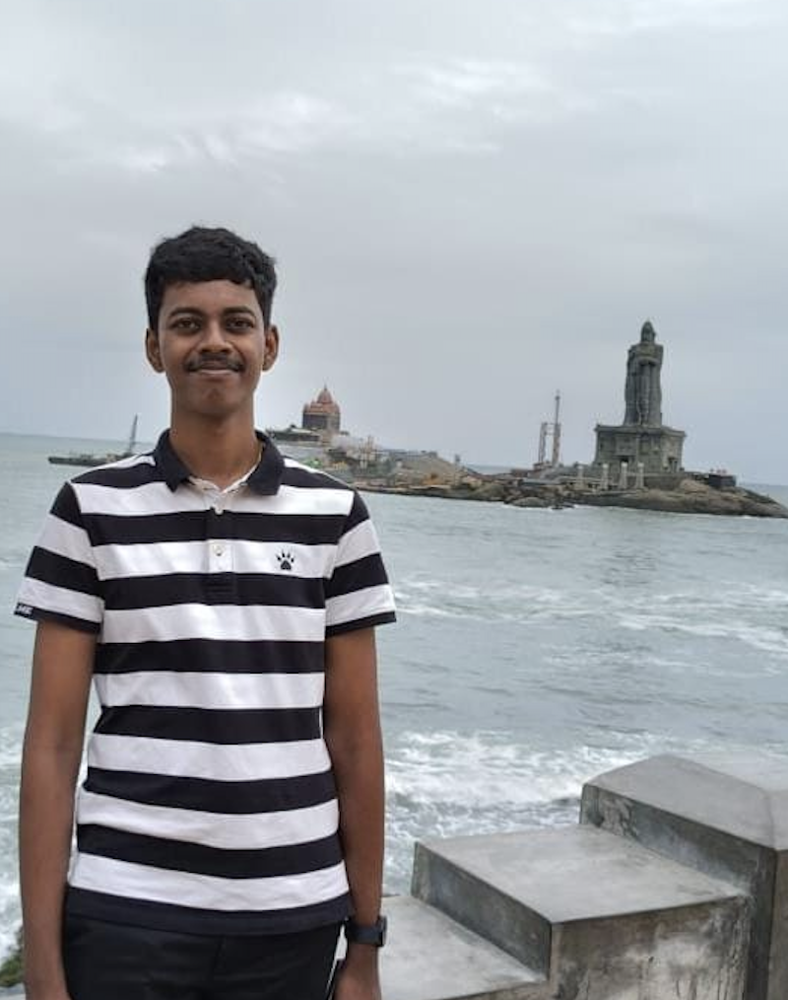

We are a team based in the [School of Computing, National University of Singapore](https://www.comp.nus.edu.sg).

You can reach us at the email `seer[at]comp.nus.edu.sg`

## Project team

### Suhayl Pervez

[[github](https://github.com/suhayl13)]
[[portfolio](team/johndoe.md)]

* Role: Testing
* Responsibilities: Testing of all logic

### Subramanian Pon Harish

[[github](http://github.com/ponharish)]
[[portfolio](team/ponharish.md)]

* Role: Develop
* Responsibilities: Backend Logic

### Lavanya Garg

[[github](http://github.com/lavanyagarg112)]
[[portfolio](team/lavanyagarg112.md)]

* Role: Testing
* Responsibilities: Ensures the testing of the project is done properly and on time.

### Ang Peng Xuan

[[github](http://github.com/angpengxuan)] [[portfolio](team/johndoe.md)]

* Role: Developer
* Responsibilities: Data

### Pradyumna Shyama Prasad

[[github](http://github.com/pradyuprasad)]
[[portfolio](team/johndoe.md)]

* Role: Developer
* Responsibilities: UI
