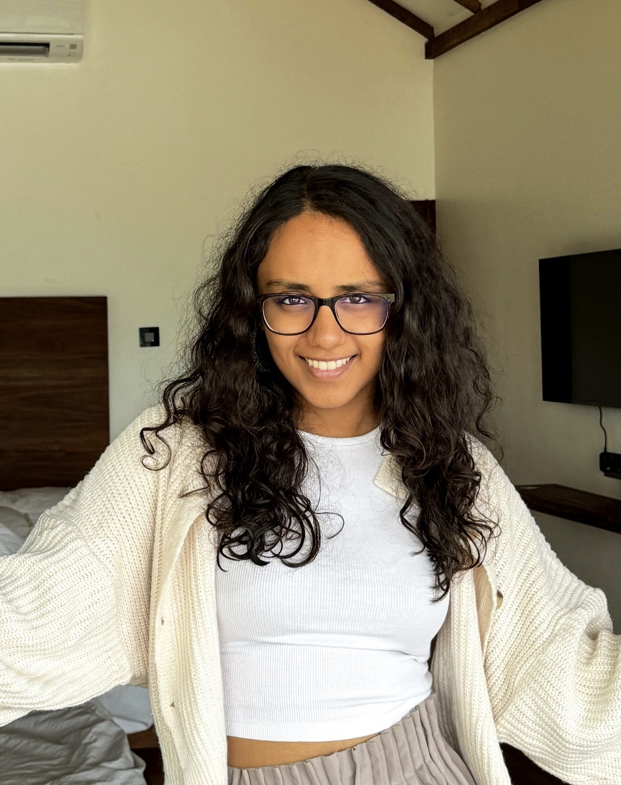

# About Us

We are a team working on our CS2103T Team Project, based in the
[School of Computing, National University of Singapore](http://www.comp.nus.edu.sg).

You can reach us at the email `seer[at]comp.nus.edu.sg`

## Project team

### Boon Hsuan

[[homepage](https://tuition-production.up.railway.app/)]
[[github](https://github.com/FlyingDonkeys)]
[[portfolio](team/boonhsuan.md)]

* Role: Project Advisor
* Responsibilities: Code stuff

### Zee

[[github](http://github.com/zeepheru)]
[[portfolio](team/zee.md)]

* Role: Team Lead, Developer
* Responsibilities: Art

### Chong Yi

[[github](https://github.com/accountexeregister)] [[portfolio](team/chongyi.md)]

* Role: Developer
* Responsibilities: Coding

### Maximus Tan

[[github](http://github.com/miloaisdino)]
[[portfolio](team/maximus.md)]

* Role: Developer
* Responsibilities: Coding

### Divya Lath

[[github](http://github.com/devivy)]
[[portfolio](team/divya.md)]

* Role: Developer
* Responsibilities: backend, UI
