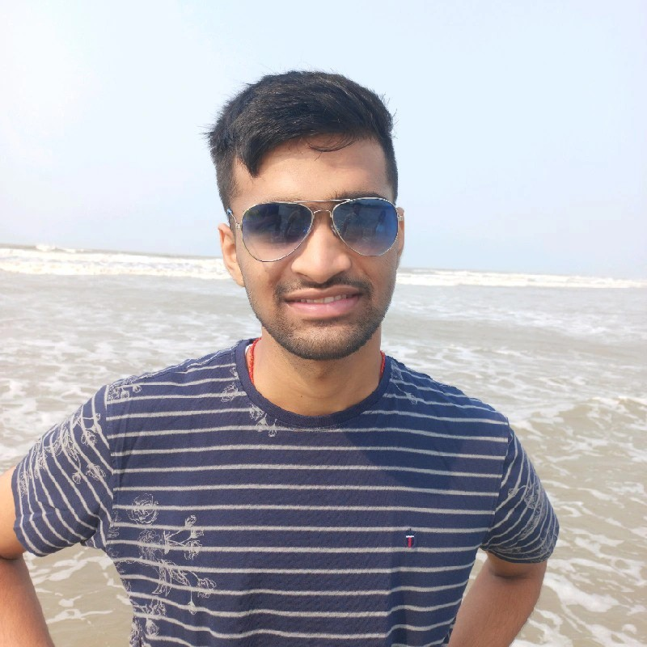

We are a team based in the [School of Computing, National University of Singapore](https://www.comp.nus.edu.sg).

You can reach us at the email `seer[at]comp.nus.edu.sg`

## Project team

### Nikhil Sultania

[[LinkedIn](www.linkedin.com/in/timenikhil)]
[[github](https://github.com/Timenikhil)]
[[portfolio](team/NikhilSultania.md)]

* Role: Team Lead

### Theodore Lim

[[github](http://github.com/obrona)]
[[portfolio](http://github.com/obrona)]

* Role: Team Lead
* Responsibilities: UI

### Josh Thoo Jen Sen

[[github](http://github.com/joshthoo)] [[portfolio](team/johndoe.md)]

* Role: Developer
* Responsibilities: Data

### Jean Doe

[[github](http://github.com/johndoe)]
[[portfolio](team/johndoe.md)]

* Role: Developer
* Responsibilities: Dev Ops + Threading

### Nathan Shew

[[github](http://github.com/nathanshew)]
[[portfolio](team/nathanshew.md)]

* Role: Developer
* Responsibilities: Project Management
