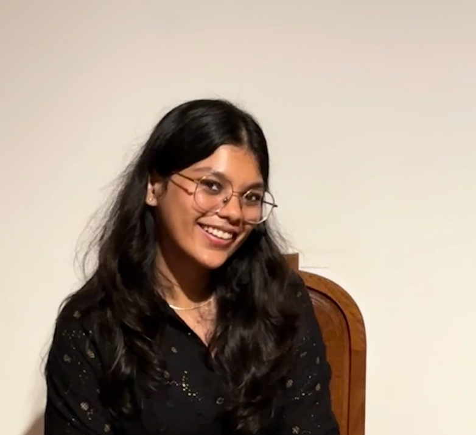

# About Us

We are a team based in the [School of Computing, National University of Singapore](http://www.comp.nus.edu.sg).

[//]: # (You can reach us at the email `seer[at]comp.nus.edu.sg`)

[[About Us](https://ay2425s1-cs2103t-f10-3.github.io/tp/)]

## NUStates

### Trisha Patodia

[[github](http://github.com/triishaa)]
[[portfolio](team/triishaa.md)]

* Role: Documentation
* Responsibilities: Responsible for the quality of various project documents.

### Low Wei Bin

[[github](http://github.com/orangecatloves)] [[portfolio](team/orangecatloves.md)]

* Role: Code-Quality
* Responsibilities: Ensures that coding quality is adhered and up to standard for every pull-request

### Dylan Wong

[[homepage](http://www.comp.nus.edu.sg/~damithch)]
[[github](https://github.com/Potatoad88)]
[[portfolio](team/dylan)]

* Role: Testing
* Responsibilities: Ensure testing is done properly and on time

### Tan Xin Quan

[[homepage](http://www.comp.nus.edu.sg/~damithch)]
[[github](http://github.com/xqtann)]
[[portfolio](team/xinquan.md)]

* Role: Integration Lead
* Responsibilities: Ensure proper version control and every PR is reviewed thoroughly

### Isaac Teo

[[homepage](http://www.comp.nus.edu.sg/~damithch)]
[[github](https://github.com/itzxitzx)]
[[portfolio](team/isaac.md)]

* Role: Team Lead
* Responsibilities: Responsible for overall project coordination.
