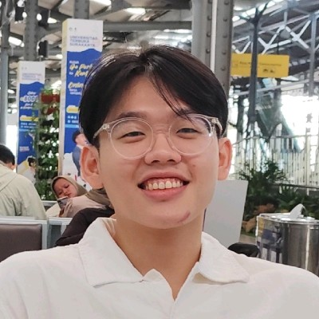

# About Us

We are a team based in the [School of Computing, National University of Singapore](http://www.comp.nus.edu.sg).

You can reach us at the email `seer[at]comp.nus.edu.sg`

## Project team

### Jabez Tho

[[github](https://github.com/jasperabez)]
[[portfolio](/team/jasperabez.md)]

* Role: Developer
* Responsibilities: Deliverables and deadlines, Scheduling and tracking

### Hans Delano

[[github](http://github.com/hanscau)] [[portfolio](team/hanscau.md)]

* Role: Developer
* Responsibilities: Test & UI

### Kevin Pek

[[github](http://github.com/kevin-pek)]
[[portfolio](team/kevin-pek.md)]

* Role: Developer
* Responsibilities: Integration, Storage

### Kok Bo Chang

[[github](http://github.com/c5hives)]
[[portfolio](team/c5hives.md)]

* Role: Developer
* Responsibilities:
  * Documentation
  * Code Quality
  * In charge of Logic Component

### Kah Suan

[[github](http://github.com/kahsuann)]
[[portfolio](team/kahsuann.md)]

* Role: Developer
* Responsibilities: Model
