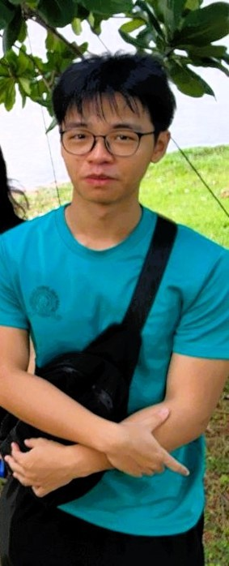

We are a team based in the [School of Computing, National University of Singapore](https://www.comp.nus.edu.sg).

You can reach us at the email `e1249111[at]u.nus.edu`

## Project team

### John Doe

[[homepage](http://www.comp.nus.edu.sg/~damithch)]
[[github](https://github.com/johndoe)]
[[portfolio](team/tohjh)]

- Role: Project Advisor

### Toh Jia Han

[[github](http://github.com/tohjh)]
[[portfolio](team/tohjh.md)]

* Role: Developer
* Responsibilities: Deliverables and deadline

### Wen Rui

[[github](http://github.com/currynia)]
[[portfolio](team/currynia.md)]

- Role: Code quality
- Responsibilities: Looks after code quality, ensures adherence to coding standards, etc.

### Swaminathan Viswa

[[github](http://github.com/SwaminathanViswa)]
[[portfolio](team/swaminathanviswa.md)]

* Role: Developer
* Responsibilities: Responsible for quality of project documentations

 ### Javier Tan Meng Wee

[[github](http://github.com/incogdino)]
[[portfolio](team/incogdino.md)]

* Role: Testing
* Responsibilities: Ensures the testing of the project is done properly and on time.
