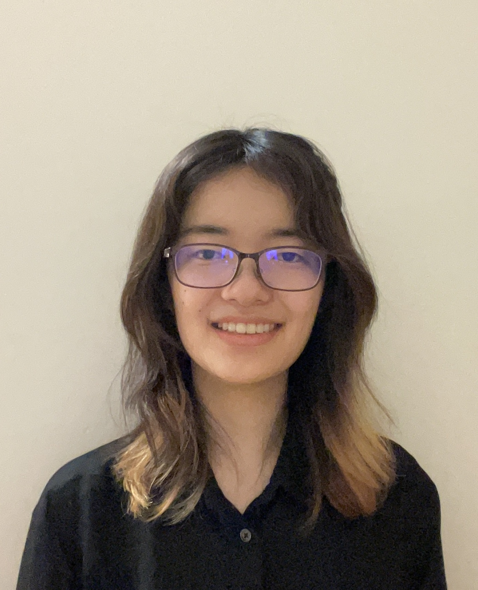

We are a team based in the [School of Computing, National University of Singapore](https://www.comp.nus.edu.sg).

You can reach us at the email `xingye[at]u.nus.edu`

## Project team

### Zhou Xingye

[[homepage](https://66f99fbb84cc0e45d28ec44b--teal-baklava-6bd705.netlify.app/)]
[[github](https://github.com/zhou-colla)]
[[portfolio](team/zhouxingye.md)]

* Role: Project Advisor

### Haleema Irfan

[[github](http://github.com/yyueyii)]
[[portfolio](team/johndoe.md)]

* Role: Developer
* Responsibilities: In charge of Logic

### Varatharaju Mithuna

[[github](http://github.com/miuna9890/tp)] [[portfolio](team/johndoe.md)]

* Role: Developer
* Responsibilities: Data

### Li Yueyi

[[github](http://github.com/yyueyii)]
[[portfolio](team/johndoe.md)]

* Role: Developer
* Responsibilities: Dev Ops + Threading

### Paing Khant Kyaw

[[github](http://github.com/minkhanteain)]
[[portfolio](team/johndoe.md)]

* Role: Developer
* Responsibilities: UI

