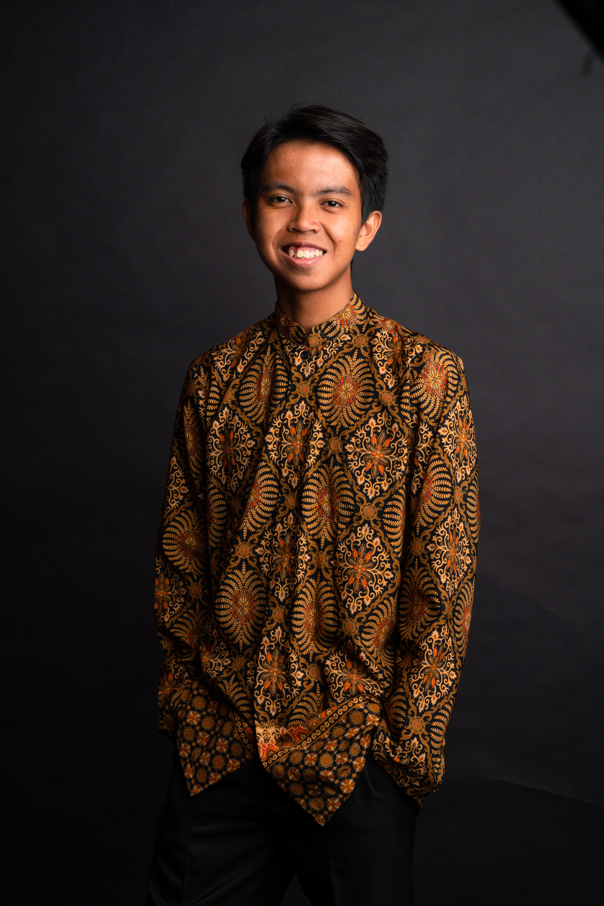

# About Us

We are a team based in the [School of Computing, National University of Singapore](http://www.comp.nus.edu.sg).

You can reach us at the email `seer@comp.nus.edu.sg`

## Project team

### Jonus Ho

[[github](http://github.com/jonushzw)]
[[portfolio](team/jonusHo.md)]

* Role: Team Lead
* Responsibilities: UI

### Li Sirui

[[github](http://github.com/siriousguy)] [[portfolio](team/siriousguy.md)]

* Role: Developer
* Responsibilities: Data

### Izzat Syazani

[[github](http://github.com/ywllowsensor)]
[[portfolio](team/ywllowsensor.md)]

* Role: Developer
* Responsibilities: Dev Ops + Threading

### Zhou Zibo

Zibo, Y2 CS undergraduate

[[github](http://github.com/zzibo)]
[[portfolio](team/zibo.md)]

* Role: Developer
* Responsibilities: UI

### Yaswitha Nalluri

[[github](https://github.com/yastsc)]
[[portfolio](team/yaswitha.md)]

* Role: Developer
* Responsibilities: Data

