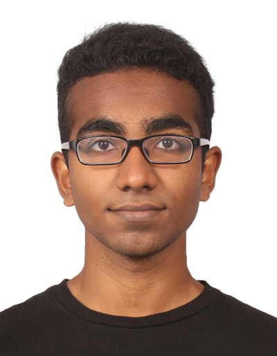
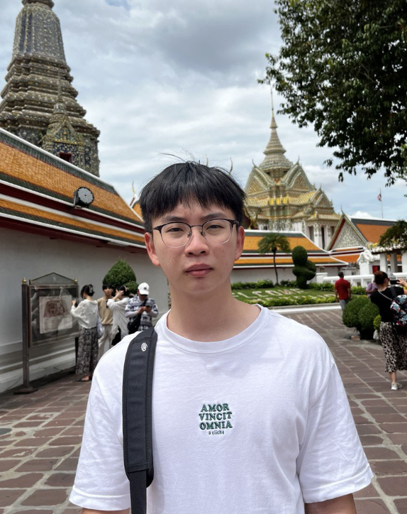

# About Us

We are a team based in the [School of Computing, National University of Singapore](http://www.comp.nus.edu.sg).

You can reach us at the email `seer[at]comp.nus.edu.sg`

## Project team

### Zwe Zeya

[[github](https://github.com/ZweZeya)]
[[portfolio](team/johndoe.md)]

* Role: Developer

### Raghava Chittidi

[[github](http://github.com/Raghava-Chittidi)]
[[portfolio](team/raghava-chittidi.md)]

* Role: Developer
* Responsibilities: Software Developer

### Johnny Doe

[[github](http://github.com/johndoe)] [[portfolio](team/johndoe.md)]

* Role: Developer
* Responsibilities: Data

### Jean Doe

[[github](http://github.com/woke02)]
[[portfolio](team/woke02.md)]

* Role: Developer
* Responsibilities: Dev Ops + Threading

### James Doe

[[github](http://github.com/johndoe)]
[[portfolio](team/johndoe.md)]

* Role: Developer
* Responsibilities: UI
