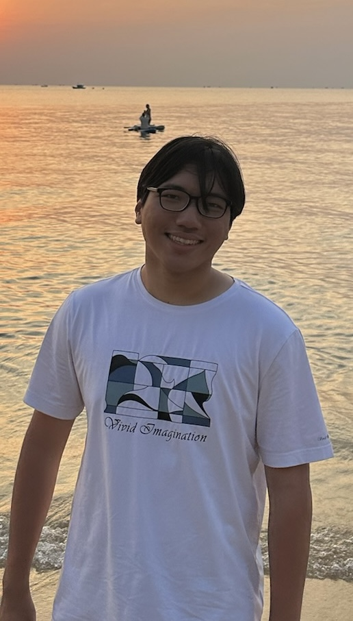

We are a team based in the [School of Computing, National University of Singapore](https://www.comp.nus.edu.sg).

You can reach us at the email `seer[at]comp.nus.edu.sg`

## Project team

### Colin Hia

[[github](http://github.com/colinhia)] 
[[portfolio](http://github.com/colinhia)]

* Role: Developer
* Responsibilities: Deliverables & Deadlines, Testing

### Litchiowong Napassorn

[[github](https://github.com/iamdiluxedbutcooler)]
[[portfolio](https://www.linkedin.com/in/plengnaps/)]

* Role: Developer
* Responsibilities: Documentation, Testing

### Tan Le Yew

[[github](http://github.com/itsme-zeix)]
[[portfolio](http://github.com/itsme-zeix)]

- Role: Developer
- Responsibilities: Scheduling & Tracking, Integration

### Fiona Qiu

[[github](https://github.com/FionaQY)]
[[portfolio](https://github.com/FionaQY)]

* Role: Developer
* Responsibilities: Code Quality

### Shun Ren

[[github](https://github.com/ZShunRen)]
[[portfolio](https://zshunren.github.io/)]

* Role: Developer
* Responsibilities: Testing, Integration
