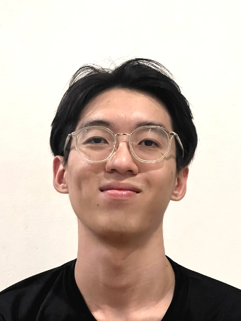
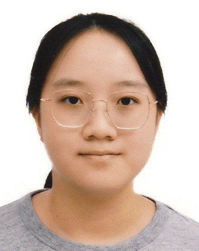

# About Us

We are a team based in the [School of Computing, National University of Singapore](http://www.comp.nus.edu.sg).

You can reach us at the email `seer[at]comp.nus.edu.sg`

## Project team

### Yik Jun Xian

[[homepage](http://www.comp.nus.edu.sg/~damithch)]
[[github](https://yikjunxian.com/johndoe)]
[[portfolio](team/johndoe.md)]

* Role: UI developer
* Responsibilities: Develop GUI features

### Sng Ying Xuan Shernice

[[github](http://github.com/shernicesng)] 
[[portfolio](team/johndoe.md)]

* Role: Developer
* Responsibilities: Code Quality

### Joey Goh

[[github](http://github.com/jowhee3011)]
[[portfolio](team/johndoe.md)]

* Role: Developer
* Responsibilities: Scheduling and tracking

### Guan Yi Sim

* Role: Developer
* Responsibilities: Testing

### Ved Joshi

[[github](http://github.com/vedjoshi)]
[[portfolio](team/johndoe.md)]

* Role: Developer
* Responsibilities: Documentation
