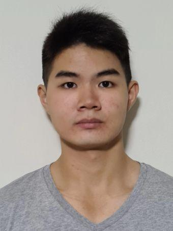

# About Us

We are a team based in the [School of Computing, National University of Singapore](http://www.comp.nus.edu.sg).

## Project team

### Clement Oh

[[github](https://github.com/Gra7ityIC3)]
[[portfolio](team/johndoe.md)]

* Role: Developer
* Responsibilities: TBC

### Wei Zhi

[[github](https://github.com/LeongWZ)]
[[portfolio](team/johndoe.md)]

* Role: Developer
* Responsibilities: TBC

### Vincent Ng

[[github](https://github.com/nws321)]
[[portfolio](team/johndoe.md)]

* Role: Developer
* Responsibilities: TBC

### Arjun Kumanan

[[github](http://github.com/arjun2598)]
[[portfolio](team/johndoe.md)]

* Role: Developer
* Responsibilities: TBC

### Terence Wong

[[github](https://github.com/TerenceWongsExtravaganza)]
[[portfolio](team/johndoe.md)]

* Role: Developer
* Responsibilities: TBC
