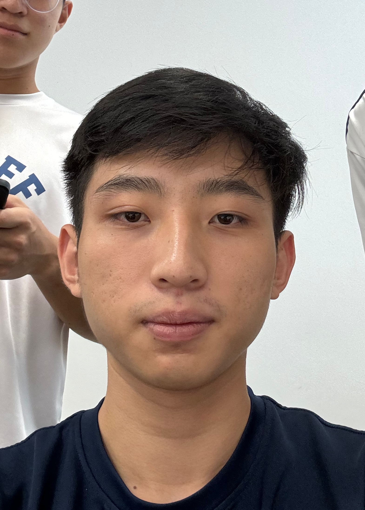

# About Us

We are a team based in the [School of Computing, National University of Singapore](http://www.comp.nus.edu.sg).

## Project team

### Julian Tay

[[Github](https://github.com/juliantayyc)]

* Role: Team Lead

### Ethan Goh

[[Github](http://github.com/ethan-goh)]

* Role: Code Quality
* Responsibilities: Ensure code follows the code quality requirements as outlined by the course.

### Brandon Tan

[[Github](http://github.com/btbrandon)]

* Role: Deliverables and Deadlines
* Responsibilities: Ensure team deliverables meet the deadlines as outlined by the course.

### Jessica

[[Github](http://github.com/jessica2828)]

* Role: Scheduling and Tracking
* Responsibilities: Assigning and managing tasks

### Jun Yu

[[Github](http://github.com/jyl27)]

* Role: Developer
* Responsibilities: UI
