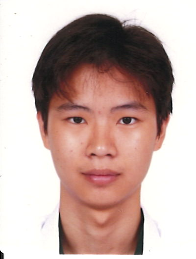
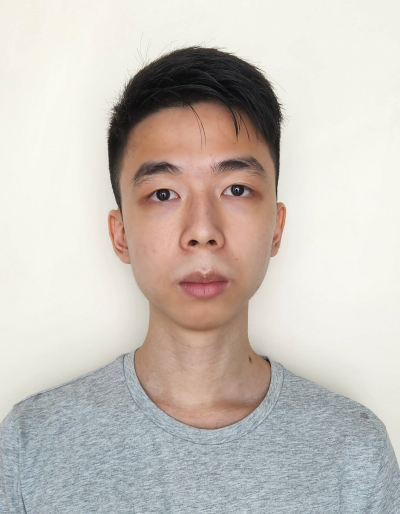
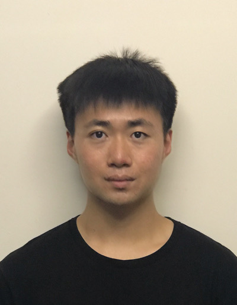

We are a team based in the [School of Computing, National University of Singapore](https://www.comp.nus.edu.sg).

## Project team

### Tan Jia En

[[github](http://github.com/jiaaaaen)]
[[portfolio](team/jiaaaaen.md)]

* Role: Developer
* Responsibilities: Data

### Tan Yi Long

[[github](http://github.com/yiiilonggg)]
[[portfolio](team/yiiilonggg.md)]

* Role: Developer
* Responsibilities: UI Changes; Addition of new `schedule` command. Assisted with `filter`, `add` command changes

### Zon

[[github](http://github.com/zlch)]
[[portfolio](team/Zon.md)]

* Role: Developer
* Responsibilities: Testing of application. Addition of commands: restore, backup

### Liu Yujia

[[github](https://github.com/LiuYJ2002)]
[[portfolio](https://www.linkedin.com/in/liu-yujia-26b167203/)]

* Role:
