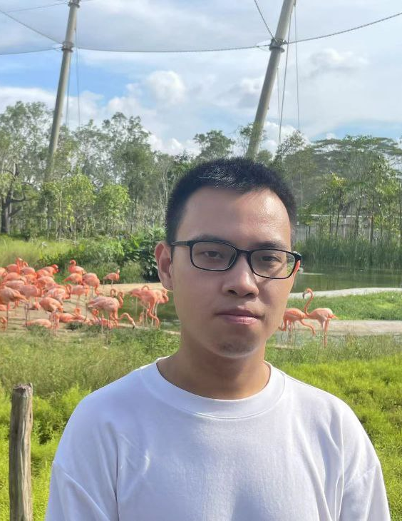

# About Us

We are a team based in the [School of Computing, National University of Singapore](http://www.comp.nus.edu.sg).

You can reach us at the email `seer[at]comp.nus.edu.sg`

## Project team

### Mao Xiongkai

[[github](https://github.com/MAOXIONGKAI)]
[[portfolio](team/maoxiongkai)]

* Role: Team Lead

### Huang Jiaxi

[[github](https://github.com/huangjiaxi1111)]
[[portfolio](team/huangjiaxi1111.md)]

* Role: Developer
* Responsibilities: Data

### Zhu Tianyi

[[github](http://github.com/lithops-zty)]
[[portfolio](team/lithops-zty.md)]

* Role: Developer
* Responsibilities: UI

### Tan Wei Seng

[[github](http://github.com/weiseng18)]
[[portfolio](team/weiseng18.md)]

* Role: Developer, Git expert
* Responsibilities: Model, Testing
