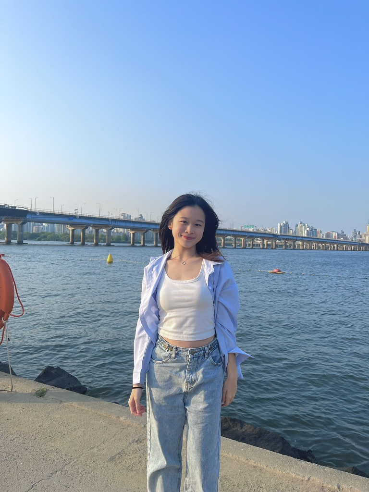
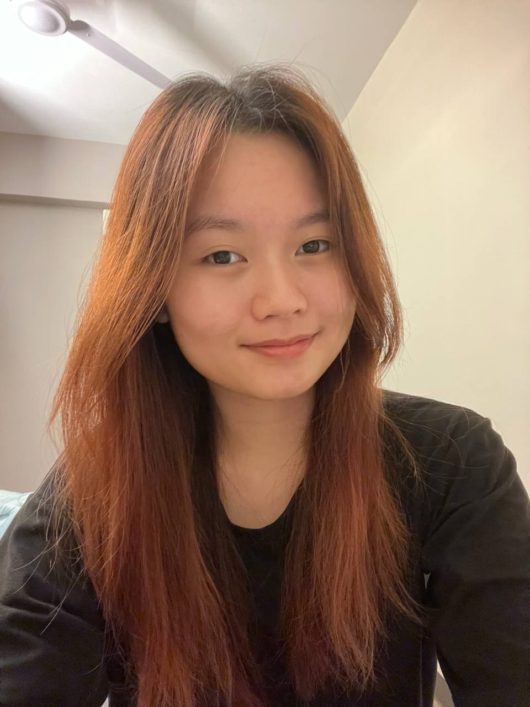

# About Us

We are a team based in the [School of Computing, National University of Singapore](http://www.comp.nus.edu.sg).

## Project team

### Lynette Lee Si Ying

[[github](https://github.com/LynetteLeeSiYing)]

* Role: Testing

### Kelly Bong Jia Qi

[[github](http://github.com/Bonzzz3)]

* Role: Code Quality
* Responsibilities: UI

### Otto Tan

[[github](http://github.com/OttoTan)]

* Role: Developer
* Responsibilities: Data

### Ritvi Agarwal

[[github](http://github.com/ritvi12)]

* Role: Developer
* Responsibilities: Dev Ops + Threading

### Nasya Myrilla Wijaya

[[github](http://github.com/myrilla12)]

* Role: Developer
* Responsibilities: UI

