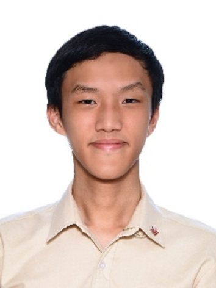

We are a team based in the [School of Computing, National University of Singapore](https://www.comp.nus.edu.sg).

You can reach us at the email `seer[at]comp.nus.edu.sg`

## Project team

### Bing Heng

[[homepage](http://www.comp.nus.edu.sg/~damithch)]
[[github](https://github.com/BuffWuff1712)]
[[portfolio](team/johndoe.md)]

* Role: Developer

### Dylan Chan

[[github](http://github.com/Vatinius)]
[[portfolio](team/johndoe.md)]

* Role: Team Lead
* Responsibilities: UI

### Xuen Ye

[[github](http://github.com/tayxuenye)] [[portfolio](team/johndoe.md)]

* Role: Developer
* Responsibilities: Data

### Teo Kai Xiang

[[github](http://github.com/tkaixiang)]
[[portfolio](team/johndoe.md)]

* Role: Developer
* Responsibilities: Full-Stack (Frontend + Backend)

### Zhang Yao

[[github](http://github.com/sayomaki)]
[[portfolio](team/johndoe.md)]

* Role: Developer
* Responsibilities: UI & Dev Ops
