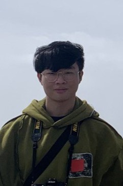
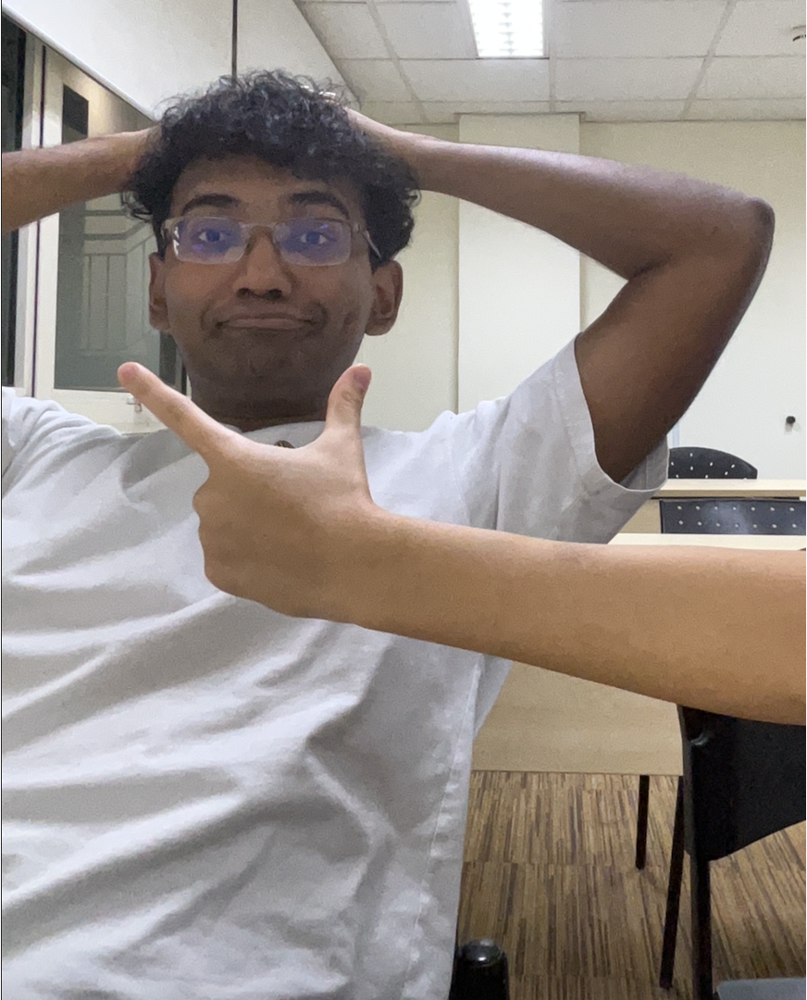

# About Us

We are a team based in the [School of Computing, National University of Singapore](http://www.comp.nus.edu.sg).

You can reach us at the email `seer[at]comp.nus.edu.sg`

## Project team

### Ethan Low

[[github](https://github.com/ethanloww)]
[[portfolio](team/johndoe.md)]

* Role: Developer
* Responsibilities: Ensure project deliverables are done on time and in the right format

### Thaddeus Foo

[[github](http://github.com/foothaddeus)] [[portfolio](team/johndoe.md)]

* Role: Documentation
* Responsibilities: Quality of Project Documents

### Siddardha Reddy Sanagala

[[github](http://github.com/Siddardar)]
[[portfolio](team/johndoe.md)]

* Role: Developer
* Responsibilities: Integration

### Skyler Ng

[[github](http://github.com/skyl3-r)]
[[portfolio](team/johndoe.md)]

* Role: Code Quality
* Responsibilities: Look after code quality, ensure adherence to coding standards.

### Eyu Gong Yi

[[github](http://github.com/EyuGongYi)]
[[portfolio](team/johndoe.md)]

* Role: Developer
* Responsibilities: Testing of Application

