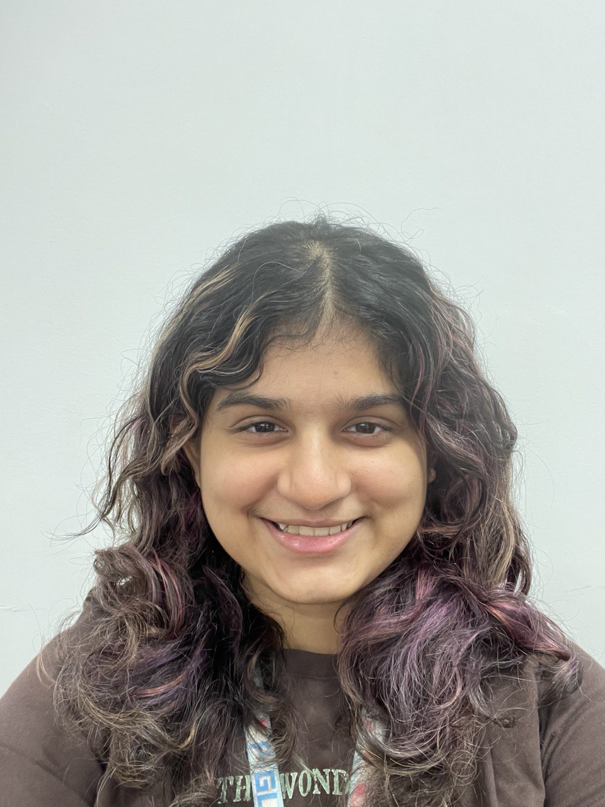

We are a team based in the [School of Computing, National University of Singapore](https://www.comp.nus.edu.sg).

You can reach us at the email `seer[at]comp.nus.edu.sg`

## Project team

### Wong Ke Xin

[[github](https://github.com/wkxcass)]
[[portfolio](team/kexin.md)]

* Role: Code quality
* Responsibilities: Looks after code quality, ensures adherence to coding standards, etc.

### Ng Kay Hian

[[github](http://github.com/k-hian)]
[[portfolio](team/kayhian.md)]

* Role: Deliverables and deadlines
* Responsibilities: Ensure project deliverables are done on time and in the right format.

### Wu Jiawei

[[github](http://github.com/wujiaweijoanna)]
[[portfolio](team/jiawei.md)]

* Role: Documentation
* Responsibilities: Responsible for the quality of various project documents.

### Prisha V Prakash

[[github](http://github.com/PrishaVP)]
[[portfolio](team/prisha.md)]

* Role: Scheduling and tracking
* Responsibilities: In charge of defining, assigning, and tracking project tasks.

### Sanchita Dhareshwar

[[github](http://github.com/sannie-beep)]
[[portfolio](team/sanchita.md)]

* Role: Developer
* Responsibilities: UI
