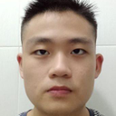

# About Us

We are a team based in the [School of Computing, National University of Singapore](http://www.comp.nus.edu.sg).

You can reach us at the email `seer[at]comp.nus.edu.sg`

## Project team

### Brendan Soh

[[homepage](http://www.comp.nus.edu.sg/~damithch)]
[[github](https://github.com/Brendan8899)]
[[portfolio](team/brendan.md)]

* Role: Software Developer

### Lim Kai Wei

[[github](https://github.com/LimKaiWei)]
[[portfolio](team/limkaiwei.md)]

* Role: Developer
* Responsibilities: Backend

### Jewi Teo

[[github](http://github.com/jewiteo)]
[[portfolio](team/jewiteo.md)]

* Role: Developer
* Responsibilities: UI

### Non Kittilakkananon

[[github](https://github.com/tata32000)]
[[portfolio](team/tata32000.md)]

### Quek Bing Heng

[[homepage](http://www.comp.nus.edu.sg/~damithch)]
[[github](https://github.com/johndoe)]
[[portfolio](team/quekbingheng.md)]

* Role: Project Advisor
