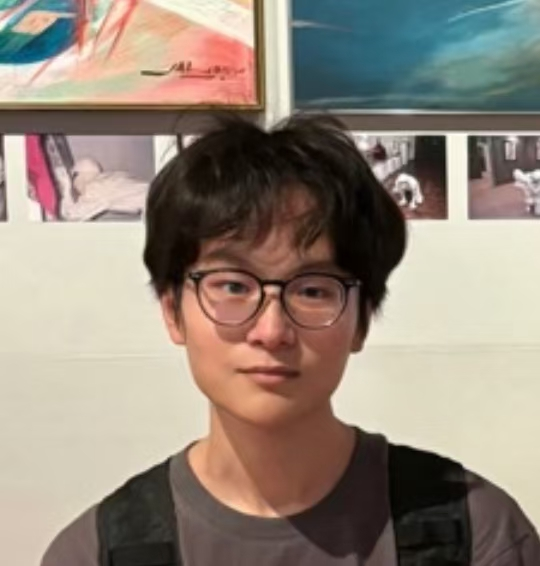

# About Us

We are a team based in the [School of Computing, National University of Singapore](http://www.comp.nus.edu.sg).

You can reach us at the email `seer[at]comp.nus.edu.sg`

## Project team

### Seah Minlong

[[github](https://github.com/seah-minlong)]
[[portfolio](team/seah-minlong.md)]

* Role: Developer
* Responsibilities: 
  * Scheduling & tracking
  * In charge of `Logic`

### Xan Ng

[[github](http://github.com/voldiemort)]
[[portfolio](team/voldiemort.md)]

* Role: Team Lead
* Responsibilities: Commons

### Johnny Doe

[[github](http://github.com/johndoe)] [[portfolio](team/johndoe.md)]

* Role: Developer
* Responsibilities: Data

### Jean Doe

[[github](http://github.com/johndoe)]
[[portfolio](team/johndoe.md)]

* Role: Developer
* Responsibilities: Dev Ops + Threading

### Zhanzhi Lou

[[github](http://github.com/zzzlou)]
[[portfolio](team/zzzlou.md)]

* Role: Developer
* Responsibilities: Documentation and in charge of Model
