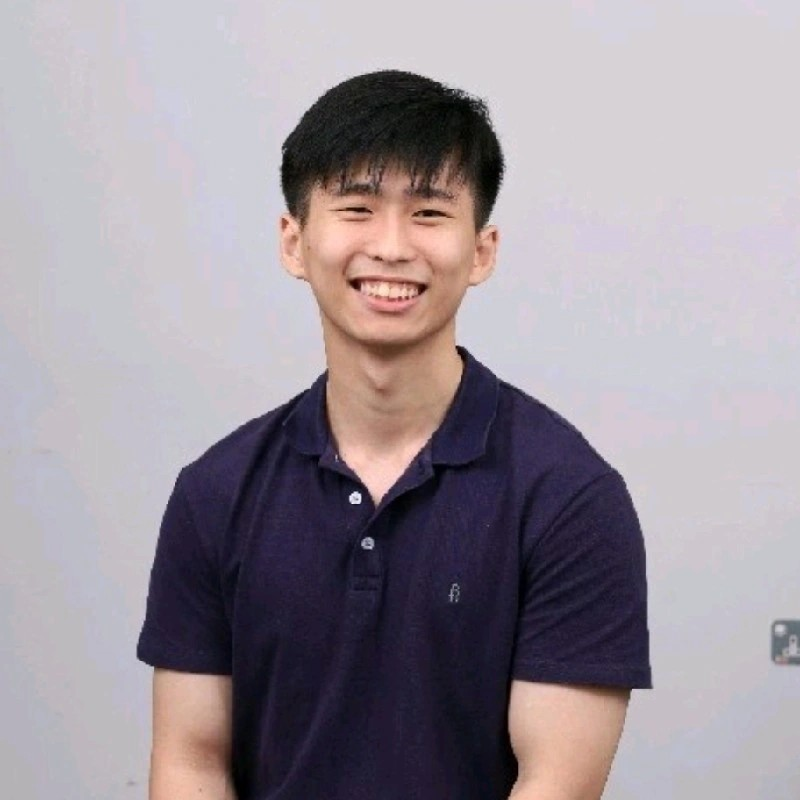

We are a team based in the [School of Computing, National University of Singapore](https://www.comp.nus.edu.sg).

You can reach us at the email `seer[at]comp.nus.edu.sg`

## Project team

## Product Name: AgentConnect

Target User: Insurance agents tracking their clients 

Value proposition: provides quick and efficient access to client details, tailored for insurance agents who need a streamlined interface to manage contacts, track policy updates, and schedule client follow-ups.

### Mant Koh En Wei

[[homepage](http://www.comp.nus.edu.sg/~damithch)]
[[github](https://github.com/m-kew)]
[[portfolio](team/m-kew.md)]

* Role: Developer
* Responsibilities: Team Lead

### Denon Chong

[[github](https://github.com/ssirmentos)]
[[portfolio](team/ssirmentos.md)]

* Role: Developer
* Responsibilities: Documentation

### Ong Juan Wen

[[github](http://github.com/the0nlyjuan)] [[portfolio](team/the0nlyjuan.md)]

* Role: Developer
* Responsibilities: Code Quality

### Edwin Wong

[[github](http://github.com/Edwin1022)]
[[portfolio](team/edwinwong.md)]

* Role: Developer
* Responsibilities: Dev Ops + Threading

### Aw Ming Yi

[[github](http://github.com/MingYiAw)]
[[portfolio](team/mingyiaw.md)]

* Role: Developer
* Responsibilities: UI
